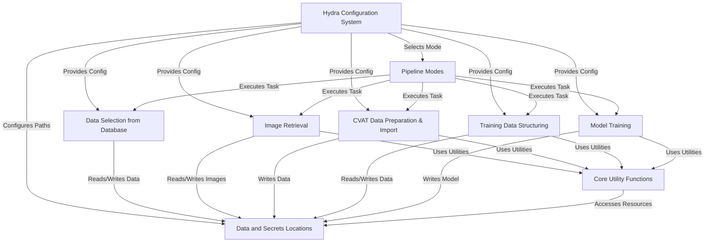

# SemiF-PlantDetection

This project is designed to update the detection models used for detecting plants in SemiField (AgIR) data.
It works by **preparing data** selected from a *database* and *long-term storage*,
which can optionally include sending it for human annotation via CVAT.
The cleaned and structured data is then used to **train an object detection model**
(like YOLO) to recognize plants, all managed by a *flexible configuration system (hydra)*.

## Chapters

1. [Hydra Configuration System
](docs/01_hydra_configuration_system_.md)
2. [Pipeline Modes
](docs/02_pipeline_modes_.md)
3. [Data and Secrets Locations
](docs/03_data_and_secrets_locations_.md)
4. [Data Selection from Database
](docs/04_data_selection_from_database_.md)
5. [Image Retrieval
](docs/05_image_retrieval_.md)
6. [CVAT Data Preparation & Import
](docs/06_cvat_data_preparation___import_.md)
7. [Training Data Structuring
](docs/07_training_data_structuring_.md)
8. [Model Training
](docs/08_model_training_.md)
9. [Core Utility Functions
](docs/09_core_utility_functions_.md)

---

Generated by [AI Codebase Knowledge Builder](https://github.com/The-Pocket/Tutorial-Codebase-Knowledge)