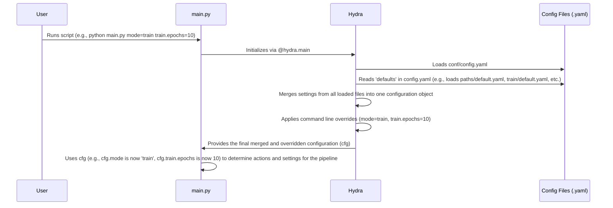

# Chapter 1: Hydra Configuration System

Welcome to the tutorial for the `SemiF-PlantDetection` project! In this first chapter, we'll dive into a fundamental concept that helps us manage all the different settings and options this project uses: the **Hydra Configuration System**.

Imagine you're about to launch a complex piece of machinery, like a factory production line. Before you press the "start" button, you need to set many dials and switches: what product to make, how fast the conveyor belt should move, which tools to use, and so on.

In software projects like this one, which can involve many steps (like processing data, training models, etc.), we also have many settings:
*   Where is the database located?
*   How many images should we use for training?
*   How many training *epochs* (cycles) should the model run for?
*   Where should the output files go?

Changing these settings directly in the code can be messy and error-prone. It's much better to have a central "control panel" where you can define all these settings in one place, or in an organized way. This is exactly what the Hydra Configuration System provides for our project.

## What is Hydra?

Hydra is a powerful tool that helps manage configuration for Python applications. Instead of writing code to handle command-line arguments or parse custom config files, you define your settings in structured files, typically using the YAML format. Hydra then loads these files and makes the settings easily accessible within your Python code.

For `SemiF-PlantDetection`, Hydra is our control panel. All the key settings for running different parts of the pipeline are defined in YAML files within the `conf/` directory.

## The Main Configuration File: `config.yaml`

Let's look at the heart of the configuration system, the main configuration file: `conf/config.yaml`.

```yaml
# conf/config.yaml
defaults:
  - database: training_dataset
  - paths: default
  - _self_
  - preprocess: default
  - train: default

# each mode is a pipeline mode
# preprocess/train
# list of tasks available in mode specific config
mode: preprocess

# ... (other settings like images, cvat, secrets_path)
```

This file is the entry point for Hydra. When the main script runs, Hydra starts by loading this `config.yaml`.

Notice the `defaults` section at the top. This is one of Hydra's key features. It tells Hydra to load *other* configuration files and combine them. For example:
*   `- database: training_dataset` tells Hydra to look for a file named `database/training_dataset.yaml` inside the `conf/` directory and load the settings from there.
*   `- paths: default` tells Hydra to load settings from `paths/default.yaml`.
*   `- preprocess: default` loads settings from `preprocess/default.yaml`.
*   `- train: default` loads settings from `train/default.yaml`.

Hydra reads all these files and merges them into a single, combined configuration. This keeps our settings organized – settings related to paths are in `paths/default.yaml`, training settings in `train/default.yaml`, and so on.

The `_self_` in `defaults` simply means "also include the settings defined directly in *this* file (`config.yaml`) itself," like the `mode: preprocess` line you see below it.

## Accessing Configuration in `main.py`

Now, how does the script actually *use* these settings? Let's look at a snippet from `main.py`:

```python
# main.py
import hydra
from omegaconf import DictConfig, OmegaConf

# ... other imports and setup ...

@hydra.main(version_base="1.2", config_path="conf", config_name="config")
def run(cfg: DictConfig) -> None:
    # Hydra loads and merges configs before calling this function
    # cfg is the combined configuration object

    cfg = OmegaConf.create(cfg) # Ensure cfg is a modifiable OmegaConf object
    log.info(f"************************************************")
    log.info(f"Pipeline mode: {cfg.mode}") # Accessing a setting from config
    log.info(f"************************************************")

    if cfg.mode not in MODE_REGISTRY:
        # ... error handling ...
        pass
    try:
        # Call the function corresponding to the selected mode
        # passing the configuration (cfg) to it
        MODE_REGISTRY[cfg.mode](cfg)
    except Exception as e:
        # ... error handling ...
        pass

# ... rest of main.py ...
```

The `@hydra.main(...)` part is special. It tells Hydra:
1.  Where to find the main configuration files (`config_path="conf"`).
2.  What the main config file is called (`config_name="config"`).
3.  What function to run after loading the configuration (`def run(...)`).

When you run `main.py`, Hydra takes over first. It finds `conf/config.yaml`, loads it, uses the `defaults` to pull in other config files, merges everything, and *then* calls the `run` function, passing the complete, merged configuration as the `cfg` argument.

Inside the `run` function, `cfg` is an object (specifically, an `OmegaConf` `DictConfig`) that contains *all* the settings from *all* the loaded YAML files. You can access any setting using dot notation, just like accessing attributes of an object:
*   `cfg.mode` gets the value of the `mode` key (`preprocess` in this case).
*   `cfg.train.epochs` would get the value of `epochs` from the `conf/train/default.yaml` file (which was loaded because of `- train: default` in `config.yaml`).
*   `cfg.paths.data_dir` gets the data directory path from `conf/paths/default.yaml`.

This `cfg` object is then passed to the specific part of the pipeline that runs (like the `preprocess` or `train` function), so those functions also have access to all the necessary settings.

## Overriding Settings from the Command Line

One of the most useful features of Hydra is the ability to easily change *any* setting from the command line, without touching the YAML files. You do this using a `key=value` syntax.

For example, if `conf/config.yaml` has `mode: preprocess`, but you want to run the training pipeline instead, you can simply run:

```bash
python main.py mode=train
```

Hydra sees `mode=train` on the command line *after* the script name. It loads the configuration as usual, but then *overrides* the `mode` setting with `train` before passing `cfg` to your `run` function.

You can override settings from any of the loaded config files. Suppose you want to train for 10 epochs instead of the default 5 (set in `conf/train/default.yaml`):

```bash
python main.py mode=train train.epochs=10
```

Here, `train.epochs` corresponds to the `epochs` key *within* the `train` section of the combined configuration.

This command-line override feature makes it super easy to experiment with different settings or run the pipeline in different ways without constantly editing files.

## How Hydra Loads and Merges Configurations (Simplified)

Let's trace what happens when you run a command like `python main.py mode=train train.epochs=10`.



Hydra essentially builds a single, complete configuration dictionary based on the `defaults` and the structure of your config directory, and then applies any command-line overrides on top of that before handing it off to your script.

## Interpolation: Reusing Values

You might have noticed syntax like `${paths.data_dir}/images` or `${paths.db_path}` in the YAML files. This is called *interpolation*. It's a way to reference values from other parts of the configuration *within* the configuration files themselves.

Look at `conf/config.yaml`:

```yaml
# conf/config.yaml
# ... other settings ...
images:
  output_path: ${paths.data_dir}/images # Uses a value from the paths config
  # ... other images settings ...

# ... more settings ...
secrets_path: ${paths.secrets_dir}/default.yaml # Uses a value from the paths config
```

And `conf/paths/default.yaml`:

```yaml
# conf/paths/default.yaml
# path to root directory
root_dir: ${hydra:runtime.cwd} # Hydra built-in variable

# path to data directory
data_dir: ${paths.root_dir}/data/ # Uses root_dir defined above

# ... other paths ...
secrets_dir: ${paths.root_dir}/secrets/ # Uses root_dir again
```

When Hydra loads these files and merges them, it also resolves these placeholders:
1.  `${hydra:runtime.cwd}` is a special Hydra variable that gets replaced with the directory from which you ran `main.py`.
2.  `${paths.root_dir}` gets replaced with the value of `root_dir` defined in the `paths` configuration.
3.  `${paths.data_dir}` gets replaced with the value of `data_dir` defined in the `paths` configuration.
4.  `${paths.secrets_dir}` gets replaced with the value of `secrets_dir` defined in the `paths` configuration.

This makes the configuration more dynamic and less repetitive. You define the base paths once in `paths/default.yaml`, and then other configuration files can easily build paths relative to those bases using interpolation.

## Conclusion

In this chapter, we learned that the Hydra Configuration System acts as the central control panel for the `SemiF-PlantDetection` project.
*   Settings are stored in organized YAML files in the `conf/` directory.
*   `conf/config.yaml` is the main entry point, using `defaults` to include settings from other files like `paths/default.yaml`, `preprocess/default.yaml`, and `train/default.yaml`.
*   The `main.py` script uses `@hydra.main` to load and merge these configurations into a single `cfg` object.
*   Settings can be accessed in the code using dot notation (e.g., `cfg.mode`, `cfg.train.epochs`).
*   You can easily override any setting from the command line using `key=value`.
*   Interpolation (`${...}`) allows reusing values within the configuration files.

Understanding Hydra is key to running and modifying the pipeline. You now know how to tell the script what to do and how to do it by modifying or overriding configuration values.

In the [next chapter](02_pipeline_modes_.md), we will explore the concept of **Pipeline Modes** and how the `mode` setting we saw in `config.yaml` controls which part of the project's workflow is executed.

[Next Chapter: Pipeline Modes](02_pipeline_modes_.md)

---

Generated by [AI Codebase Knowledge Builder](https://github.com/The-Pocket/Tutorial-Codebase-Knowledge)