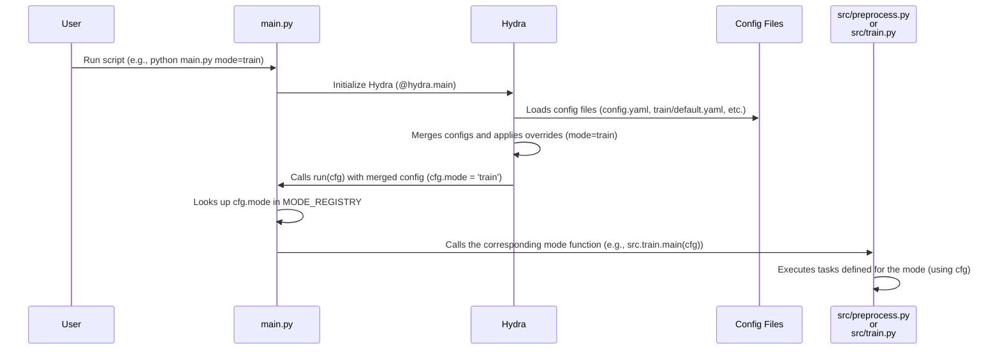

# Chapter 2: Pipeline Modes

Welcome back to the `SemiF-PlantDetection` tutorial! In the [previous chapter](01_hydra_configuration_system_.md), we learned how the Hydra Configuration System acts as our project's control panel, allowing us to manage settings using YAML files and command-line overrides. We saw how the `conf/config.yaml` file is loaded and how we can access settings like `cfg.mode`.

Now, let's explore what that `mode` setting actually *does* and why it's so important. This chapter is all about **Pipeline Modes**.

Imagine the `SemiF-PlantDetection` project is like a helpful robot designed to do different jobs related to finding plants in images. Sometimes you need the robot to prepare all the tools and materials (`preprocess`), and sometimes you need it to actually build the final product (`train`). These are distinct jobs with different steps.

Instead of having two completely separate robots or scripts, we have *one* main script (`main.py`) that can switch between these different jobs. How does it know which job to do? By checking the **Pipeline Mode** specified in the configuration!

## What are Pipeline Modes?

In this project, a "Pipeline Mode" is essentially a predefined workflow or a set of tasks that the script should perform. It's like choosing a specific recipe from our cookbook:
*   The `preprocess` mode recipe involves tasks like finding the right data, downloading images, and preparing them in a specific format.
*   The `train` mode recipe involves tasks like structuring the data for training and then running the model training process.

The main script (`main.py`) acts as a traffic controller or a dispatcher. It looks at the `mode` setting and directs the execution to the code responsible for that specific workflow.

## The Main Modes: `preprocess` and `train`

The two primary pipeline modes in `SemiF-PlantDetection` are:

1.  **`preprocess`**: This mode focuses on getting your data ready. It includes tasks like selecting data from a database, downloading images, and converting annotation data into the format needed for training.
2.  **`train`**: This mode focuses on the machine learning part. It includes tasks like preparing the data directory structure required by the training framework and running the model training process itself.

You tell the script which mode you want to run using the configuration.

## How to Choose a Pipeline Mode

As we saw in the [previous chapter](01_hydra_configuration_system_.md), the easiest way to choose a mode is through the configuration file `conf/config.yaml` or by overriding the setting on the command line.

**1. Default Mode in `conf/config.yaml`:**

The `conf/config.yaml` file contains the default settings, including the default mode:

```yaml
# conf/config.yaml
defaults:
  # ... other defaults ...
  - _self_
  - preprocess: default # Loads preprocess-specific settings
  - train: default      # Loads train-specific settings

# --- Choose the pipeline mode here ---
mode: preprocess # <--- This line sets the default mode
# --------------------------------------

# ... rest of config ...
```

In this example, the default mode is `preprocess`. If you just run `python main.py` without any command-line arguments, the script will execute in `preprocess` mode.

**2. Overriding Mode from the Command Line:**

Just like any other configuration setting managed by Hydra (as explained in [Chapter 1](01_hydra_configuration_system_.md)), you can easily override the `mode` setting directly from your terminal.

To run in `train` mode instead of the default `preprocess`, you would use:

```bash
python main.py mode=train
```

This tells Hydra to load all the configurations as usual, but to specifically set the `mode` value to `train` before running the main function. This is the most common way to switch between the main workflows.

## How the Script Dispatches Modes (Under the Hood)

Let's look at the `main.py` script to see how it uses the `mode` setting to decide what to do.

Here's a simplified snippet focusing on the mode logic:

```python
# main.py (Simplified)
import hydra
from omegaconf import DictConfig
# Import the main functions for each mode
from src.preprocess import main as preprocess_main
from src.train import main as train_main

# A dictionary mapping mode names (from config) to the actual functions
MODE_REGISTRY = {
    "preprocess": preprocess_main,
    "train": train_main
}

@hydra.main(...) # Hydra loads config and calls this function
def run(cfg: DictConfig) -> None:
    # cfg contains all merged config settings, including cfg.mode

    log.info(f"Pipeline mode: {cfg.mode}") # Log the selected mode

    if cfg.mode not in MODE_REGISTRY:
        # Handle unknown mode error
        pass
    try:
        # *** This is where the dispatch happens! ***
        # Look up the function in MODE_REGISTRY using cfg.mode
        # and call that function, passing the entire config (cfg)
        MODE_REGISTRY[cfg.mode](cfg)
    except Exception as e:
        # Handle errors during mode execution
        pass

# ... rest of main.py ...
```

**Explanation:**

1.  **`MODE_REGISTRY`**: This is a standard Python dictionary. It holds the "mapping" or "lookup table" between the *string name* of a mode (like `"preprocess"`) and the actual Python *function* that should be executed for that mode (`src.preprocess.main`).
2.  **`cfg.mode`**: Inside the `run` function (which Hydra calls after loading configuration), we access the value of the `mode` setting using `cfg.mode`.
3.  **`MODE_REGISTRY[cfg.mode]`**: We use the value of `cfg.mode` as a *key* to look up the corresponding function in the `MODE_REGISTRY` dictionary. If `cfg.mode` is `"preprocess"`, this looks up `MODE_REGISTRY["preprocess"]`, which gives us the `src.preprocess.main` function.
4.  **`(...) (cfg)`**: We then immediately call the function we just looked up, passing the full configuration object `cfg` to it.

So, if `cfg.mode` is `"preprocess"`, the line `MODE_REGISTRY[cfg.mode](cfg)` effectively becomes `src.preprocess.main(cfg)`. If `cfg.mode` was `"train"`, it would become `src.train.main(cfg)`.

This is a clean and common way to dispatch execution based on a configuration value. The `main.py` script stays minimal and just acts as the dispatcher; the actual logic for each mode lives in separate files (`src/preprocess.py`, `src/train.py`).

Here's a simple diagram showing this flow:



## Modes and Tasks

Once the main script dispatches to a specific mode function (like `src.preprocess.main`), what does that function do?

Each mode function is responsible for orchestrating a sequence of *tasks* that make up that particular workflow. These tasks are also defined in the configuration!

Remember the `defaults` section in `conf/config.yaml` from [Chapter 1](01_hydra_configuration_system_.md)? It included lines like `- preprocess: default` and `- train: default`. These lines tell Hydra to load additional configuration files specific to each mode (`conf/preprocess/default.yaml` and `conf/train/default.yaml`).

Let's look at `conf/preprocess/default.yaml`:

```yaml
# conf/preprocess/default.yaml
tasks: # <-- This list defines the tasks for preprocess mode
  - training_dataset
  - download_images
  - cvat_formatter
  - cvat_importer

# ... other preprocess-specific settings ...
```

And `conf/train/default.yaml`:

```yaml
# conf/train/default.yaml
tasks: # <-- This list defines the tasks for train mode
  - prepare_dataset
  - train_model

# ... other train-specific settings ...
```

When `main.py` runs and dispatches to, say, `src.preprocess.main(cfg)`, the `cfg` object it receives contains *all* configuration, including the settings loaded from `conf/preprocess/default.yaml`. The `src.preprocess.main` function can then access the list of tasks for its mode via `cfg.preprocess.tasks`.

Here's a simplified look inside a mode function (`src/preprocess.py`):

```python
# src/preprocess.py (Simplified)
from omegaconf import DictConfig
import logging
# Import functions for each potential task
from src.preprocessing.training_dataset import main as training_dataset_main
# ... other task imports ...

log = logging.getLogger(__name__)

# A dictionary mapping task names to their functions for THIS mode
TASK_REGISTRY = {
    "training_dataset": training_dataset_main,
    # ... mappings for download_images, cvat_formatter, cvat_importer ...
}

def main(cfg: DictConfig):
    """
    Main entrypoint for preprocess mode.
    Orchestrates preprocess tasks.
    """
    log.info(f"Tasks for preprocess mode: {cfg.preprocess.tasks}") # Access tasks list

    # *** Iterate through the tasks list defined in config ***
    for task_name in cfg.preprocess.tasks:
        if task_name in TASK_REGISTRY:
            log.info(f"Running task: {task_name}")
            # *** Look up the task function and call it ***
            TASK_REGISTRY[task_name](cfg) # Pass the config to the task function too
        else:
            # Handle unknown task error
            pass

# ... rest of src/preprocess.py ...
```

**Explanation:**

1.  **`TASK_REGISTRY`**: Similar to `MODE_REGISTRY` in `main.py`, this is a dictionary specific to the `preprocess` mode. It maps the *string name* of a task (like `"download_images"`) to the actual Python *function* that performs that task (`src.preprocessing.download_images.main`).
2.  **`cfg.preprocess.tasks`**: The mode function accesses the list of tasks defined in its configuration file (e.g., `conf/preprocess/default.yaml`) using `cfg.preprocess.tasks`. Remember from [Chapter 1](01_hydra_configuration_system_.md) that Hydra merges configurations, so `cfg.preprocess` holds everything from `conf/preprocess/default.yaml`.
3.  **`for task_name in cfg.preprocess.tasks:`**: The script loops through the list of task names.
4.  **`TASK_REGISTRY[task_name](cfg)`**: For each task name in the list, it looks up the corresponding function in the `TASK_REGISTRY` and calls that function, again passing the full `cfg` object so the task has access to *all* necessary settings (paths, image settings, etc.).

This layered approach (main script dispatches to mode function, mode function iterates and dispatches to task functions) makes the project modular and organized. You can easily see which tasks belong to which mode and control the order or inclusion of tasks by modifying the `tasks` list in the mode's configuration file.

You can even override the task list from the command line! For example, to run only the `download_images` task in preprocess mode:

```bash
python main.py mode=preprocess preprocess.tasks='[download_images]'
```

Note the quotes and square brackets: this is Hydra/OmegaConf syntax for overriding a list value on the command line.

## Conclusion

In this chapter, we learned about Pipeline Modes, the core concept for directing the `SemiF-PlantDetection` script to perform specific jobs:
*   The main modes are `preprocess` and `train`, each representing a complete workflow.
*   You select the desired mode using the `mode` setting in `conf/config.yaml` or by overriding it on the command line (e.g., `python main.py mode=train`).
*   The `main.py` script acts as a dispatcher, using a `MODE_REGISTRY` to call the appropriate mode function based on the `cfg.mode` value.
*   Each mode function (like `src.preprocess.main`) then orchestrates its own sequence of tasks, which are defined in the mode-specific configuration file (e.g., `conf/preprocess/default.yaml`) under the `tasks` key and accessed via `cfg.<mode_name>.tasks`.
*   Mode functions use a `TASK_REGISTRY` to look up and call the individual task functions.

Understanding pipeline modes and how they dispatch tasks is fundamental to running and customizing the project.

Now that you know *what* job (mode) to run and *how* that mode executes its sequence of tasks, the next logical step is to understand *where* the project expects to find input data and *where* it will save its outputs, as well as how sensitive information (secrets) is handled.

[Next Chapter: Data and Secrets Locations](03_data_and_secrets_locations_.md)

---

Generated by [AI Codebase Knowledge Builder](https://github.com/The-Pocket/Tutorial-Codebase-Knowledge)