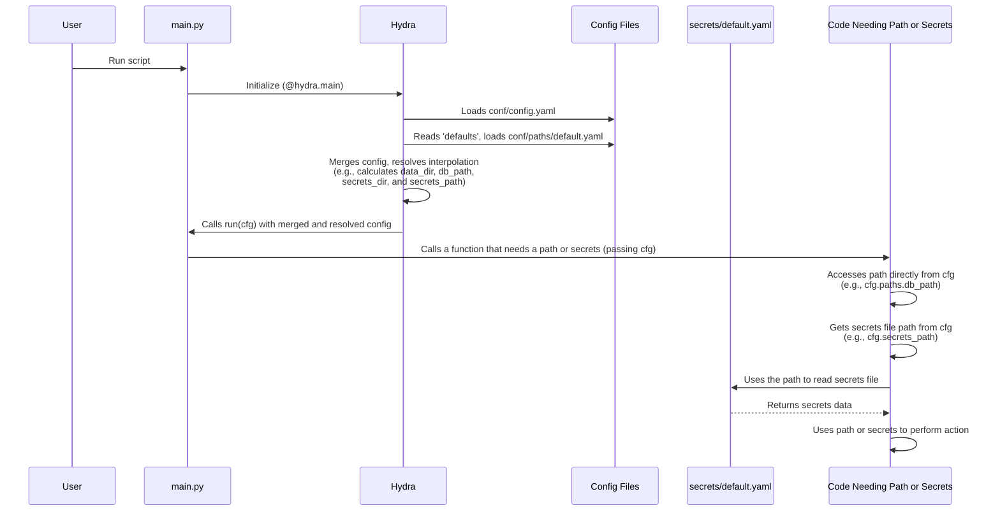

# Chapter 3: Data and Secrets Locations

Welcome back to the `SemiF-PlantDetection` tutorial! In the [previous chapters](01_hydra_configuration_system_.md) ([Chapter 1](01_hydra_configuration_system_.md) on Hydra Configuration and [Chapter 2](02_pipeline_modes_.md) on Pipeline Modes), we learned how the project uses a flexible configuration system to set up its operations and how it switches between different overall workflows (`preprocess`, `train`).

Now, let's tackle a fundamental question for any project that works with files and sensitive information: **How does the project know *where* to find everything it needs, and *where* to put things it creates?** Where are the original images stored? Where is the database file? Where should temporary files go? And most importantly, where are the sensitive passwords and keys kept safely?

This chapter is like getting the map and the keys to the project's resources. We'll see how the project defines and finds the locations for data, logs, models, and sensitive secrets.

## The Map: Paths Configuration

Just like you use a map to find your way around a city, the `SemiF-PlantDetection` project uses a "map" defined in its configuration to know where important directories and files are located.

This map is primarily stored in the `conf/paths/default.yaml` file. Remember from [Chapter 1](01_hydra_configuration_system_.md) how `conf/config.yaml` uses the `defaults` section to load other configuration files? The line `- paths: default` is what tells Hydra to load the settings from `conf/paths/default.yaml`.

Let's look at a simplified version of this file:

```yaml
# conf/paths/default.yaml

# path to root directory
root_dir: ${hydra:runtime.cwd} # Hydra magic: directory where main.py is run

# path to data directory (for temporary/generated data)
data_dir: ${paths.root_dir}/data/

# path to logging directory
log_dir: ${paths.root_dir}/logs/

# path to database file
db_path: ${paths.root_dir}/agir.db # Example: database file at the root

# path to secrets directory
secrets_dir: ${paths.root_dir}/secrets/

# List of locations where original, long-term images might be stored
lts_locations:
  - /mnt/research-projects/s/screberg/longterm_images
  - /mnt/research-projects/s/screberg/GROW_DATA

# List of locations where human annotations for LTS images are stored
lts_human_annotations:
  - /mnt/research-projects/s/screberg/longterm_images2/semifield-database/plant-detection/annotations/

# ... other paths ...
```

This file defines key locations using clear, descriptive names. Notice a few things:

*   **Interpolation (`${...}`):** As we saw in [Chapter 1](01_hydra_configuration_system_.md), Hydra uses interpolation to build paths dynamically. `root_dir` uses `${hydra:runtime.cwd}` (a built-in Hydra value that means "the current working directory where you ran `main.py`"). Other paths like `data_dir`, `log_dir`, `db_path`, and `secrets_dir` are then built relative to this `root_dir` using `${paths.root_dir}`. This means you can run the project from different directories, and the paths will adjust automatically as long as the project structure relative to `main.py` is maintained.
*   **Specific Locations:** `db_path` points directly to the SQLite database file. `lts_locations` is a *list* of directories where the project might find the massive collection of original, high-resolution images. `lts_human_annotations` is a list of directories where exported human annotation files (e.g., from CVAT) for those long-term storage images are kept.

## How the Project Uses These Paths

Once Hydra loads `conf/paths/default.yaml` (via `conf/config.yaml`) and merges it into the main configuration object `cfg`, any part of the code can access these locations.

For example, if a task needs to access the database, it gets the database path from `cfg.paths.db_path`. If a task needs to save downloaded images, it gets the output directory from `cfg.images.output_path`, which itself is defined in `conf/config.yaml` using interpolation: `images.output_path: ${paths.data_dir}/images`.

Here's how a part of the code might access a path:

```python
# Example: Accessing the database path in code
from omegaconf import DictConfig # cfg will be this type

def access_database(cfg: DictConfig):
    db_path = cfg.paths.db_path # Get the database path from config
    print(f"Attempting to connect to database at: {db_path}")
    # ... code to connect to the database using db_path ...

# When a task function runs, it receives the cfg object
# access_database(cfg) # This function would be called with the full cfg
```

This is much cleaner than hardcoding paths directly in the code.

Similarly, the `lts_locations` list is used by tasks that need to search for the original image files:

```python
# Example: Using the list of long-term storage locations
from omegaconf import DictConfig
import logging
from pathlib import Path

log = logging.getLogger(__name__)

# Simplified function from src/utils/utils.py
def get_annotated_image_ids(lts_locations_list):
    image_ids = {}
    for lts_location_str in lts_locations_list:
        base_path = Path(lts_location_str)
        if not base_path.exists():
            log.warning(f"LTS path not found: {base_path}")
            continue
        log.info(f"Searching for annotations in: {base_path}")
        # ... code to search for annotation files within base_path ...
    return image_ids # Simplified

# When a relevant task runs...
# annotated_ids = get_annotated_image_ids(cfg.paths.lts_human_annotations)
# The function receives the list directly from the config
```

This pattern (define paths in `conf/paths/default.yaml`, access via `cfg.paths.<name>`, use interpolation) is consistent throughout the project.

## The Key: Secrets Configuration

Now, let's talk about sensitive information – the project's "keys". Some parts of the pipeline might need credentials to access databases, external services, or APIs. These secrets (like usernames and passwords) *must not* be stored directly in the main configuration files or in the code repository for security reasons.

The standard practice is to keep secrets in a separate file that is *not* committed to version control (like Git). The `SemiF-PlantDetection` project follows this by using a dedicated secrets file, typically located in a `secrets/` directory.

But how does the project know where this secrets file is? The *path* to the secrets file *is* defined in the main configuration (`conf/config.yaml`), but it points to the separate secrets file:

```yaml
# conf/config.yaml
# ... other settings ...

# configure credentials
secrets_path: ${paths.secrets_dir}/default.yaml # <-- Path to the secrets file
```

This line uses interpolation `${paths.secrets_dir}` (which gets its value from `conf/paths/default.yaml`, typically `${paths.root_dir}/secrets/`) to point to a file named `default.yaml` inside the `secrets` directory.

The actual contents of the `secrets/default.yaml` file would look something like this (this file is **not** included in the repository; you would create it based on a template or instructions):

```yaml
# secrets/default.yaml (YOU CREATE THIS FILE AND DO NOT COMMIT IT)
database:
  username: my_db_user
  password: super_secret_password_123!
  host: localhost
  port: 5432

# Other potential secrets
external_api:
  key: abcdef123456
```

As the `secrets/README.md` file indicates, this folder is intended to contain these formatted secrets files.

## How Secrets Are Read

When a part of the project needs credentials, it doesn't access them directly from the main `cfg` object. Instead, it uses the `secrets_path` from the `cfg` object and passes it to a utility function that reads the secrets file.

The `src/utils/utils.py` file contains a function `read_secrets` for this exact purpose:

```python
# src/utils/utils.py (Simplified)
import yaml
import logging

log = logging.getLogger(__name__)

def read_secrets(keypath):
    """Reads secrets from a YAML file."""
    try:
        with open(keypath, "r") as file:
            secrets = yaml.safe_load(file)
        log.info(f"Successfully read secrets from {keypath}")
        return secrets
    except FileNotFoundError:
        log.error(f"Secrets file not found at {keypath}")
        raise # Re-raise the exception
    except Exception as e:
        log.error(f"Error reading secrets file {keypath}: {e}")
        raise

# ... other utility functions ...
```

Here's how a part of the code needing database credentials might use this:

```python
# Example: Accessing database secrets in code
from omegaconf import DictConfig
from src.utils.utils import read_secrets # Import the utility function

def connect_to_external_db(cfg: DictConfig):
    # 1. Get the path to the secrets file from the main config
    secrets_file_path = cfg.secrets_path

    # 2. Use the utility function to read the secrets from that file
    all_secrets = read_secrets(secrets_file_path)

    # 3. Access the specific secrets needed (e.g., database credentials)
    db_creds = all_secrets.get("database") # Get the 'database' section

    if db_creds:
        print(f"Using database user: {db_creds.get('username')}")
        # ... code to connect using db_creds['username'] and db_creds['password'] ...
    else:
        print("Database secrets not found in secrets file.")

# When the database connection code runs, it gets the cfg object
# connect_to_external_db(cfg) # This function would be called
```

This two-step process (config points to secrets file, code reads secrets from that file) keeps secrets out of the main configuration that might be more widely shared or logged.

## How It All Works Together (Under the Hood)

Let's trace the flow when the script needs to know where the database is and where the secrets are located:



1.  Hydra starts by loading `conf/config.yaml`.
2.  It sees `- paths: default` in the `defaults` and loads `conf/paths/default.yaml`.
3.  Hydra merges these configurations.
4.  It then resolves all the interpolation syntax (`${...}`), calculating the final values for `root_dir`, `data_dir`, `db_path`, `secrets_dir`, and importantly, `secrets_path` (using the resolved `secrets_dir`).
5.  Hydra calls the `run` function in `main.py`, passing the complete `cfg` object which now contains the final, resolved path strings.
6.  Any code function that receives `cfg` can directly access any defined path using dot notation (e.g., `cfg.paths.data_dir`).
7.  If the code needs sensitive information, it gets the *path* to the secrets file (`cfg.secrets_path`) and then uses a utility function (like `read_secrets`) to read the contents of that separate secrets file.

This setup provides a clean, centralized way to manage all locations while keeping sensitive information safely separated.

## Conclusion

In this chapter, we learned how the `SemiF-PlantDetection` project manages the locations of its important resources:
*   Key directories and file paths (like `data_dir`, `log_dir`, `db_path`, `lts_locations`) are defined in `conf/paths/default.yaml`.
*   These paths are accessed in code via the `cfg` object (e.g., `cfg.paths.db_path`).
*   Interpolation (`${...}`) is used to build paths dynamically and make the configuration flexible.
*   Sensitive information (secrets) is stored in a separate file (e.g., `secrets/default.yaml`) that is not part of the code repository.
*   The path to the secrets file is defined in `conf/config.yaml` using the paths configuration (`secrets_path: ${paths.secrets_dir}/default.yaml`).
*   A utility function (`src.utils.utils::read_secrets`) is used to safely read the contents of the secrets file from the path specified in `cfg.secrets_path`.

Understanding where the project expects to find its data and how it accesses secrets is crucial for setting it up correctly and running the various pipeline modes. You now have the "map" and the understanding of how the "keys" (secrets path) are handled.

Now that we know *where* the data and secrets are located, the next step in the `preprocess` pipeline (which is the default mode) is often to figure out *which* specific data points (e.g., which images) we want to process. This selection is typically based on criteria stored in the database.

[Next Chapter: Data Selection from Database](04_data_selection_from_database_.md)

---

Generated by [AI Codebase Knowledge Builder](https://github.com/The-Pocket/Tutorial-Codebase-Knowledge)