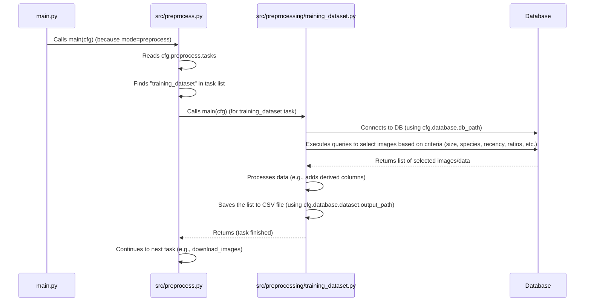

# Chapter 4: Data Selection from Database

Welcome back to the `SemiF-PlantDetection` tutorial! In our journey so far:
*   We learned how the [Hydra Configuration System](01_hydra_configuration_system_.md) helps us manage all project settings in an organized way.
*   We explored [Pipeline Modes](02_pipeline_modes_.md), understanding how the project switches between major workflows like `preprocess` and `train`.
*   We covered [Data and Secrets Locations](03_data_and_secrets_locations_.md), learning how the project knows where to find data like the SQLite database and how it handles sensitive information securely.

Now that we know *where* our database is located, the next crucial step in the `preprocess` pipeline is deciding *which specific images and annotations* from that potentially massive database we actually want to use. We can't train a model on everything! We need to select a relevant subset.

This is the role of the **Data Selection from Database** abstraction.

Imagine you have a vast library filled with millions of books (your database of images and annotations). You want to learn about a very specific topic, say, "identifying different types of flowering plants in spring." You wouldn't just grab random books. You'd ask the librarian for help, providing criteria like:
*   "I need books about 'flowering plants'." (Prioritizing certain species/classes)
*   "Show me the newest books first, especially those published recently." (Prioritizing recent data/batches)
*   "Make sure I have a good mix – don't give me 100 books on just roses and only 1 on tulips, even if you have more rose books." (Balancing class representation)
*   "I only have time to read 50 books." (Setting a dataset size limit)

The librarian (our Data Selection abstraction) carefully selects a smaller, manageable collection of books (images and annotations) that best fit your learning goals (training criteria).

## What is Data Selection from Database?

In the `SemiF-PlantDetection` project, the "Data Selection from Database" is a specific task within the `preprocess` pipeline mode. Its primary goal is to **query the SQLite database and identify a subset of images and their associated annotation data that are suitable for training or other processing steps.**

It applies various criteria defined in the configuration to make this selection, including:
*   Prioritizing images containing specific plant species (classes).
*   Favoring images from more recent data collection batches.
*   Attempting to balance the representation of different classes in the final selection.
*   Selecting non-target examples based on specific criteria.
*   Limiting the total number of images selected.

The output of this task is typically a file (like a CSV) listing the `image_id`s and relevant metadata for the selected images. This list then serves as the input for subsequent tasks, like downloading the actual image files from storage.

## The Use Case: Generating the Training Data List

The central use case for this concept is **generating the list of images that will form our training dataset.** We tell the project: "Go look in the database, find validated images with annotations, and give me a list of X images that meet these criteria (species Y and Z, recent batches, balanced mix)."

## How to Use Data Selection

Data selection is performed by the `training_dataset` task, which is part of the default `preprocess` pipeline mode.

**1. Running the Task:**

Since `training_dataset` is a default task in `preprocess` mode (as defined in `conf/preprocess/default.yaml` which we saw in [Chapter 2](02_pipeline_modes_.md)), you typically run it simply by executing the `preprocess` mode:

```bash
python main.py mode=preprocess
```

This command tells Hydra to load the `preprocess` configuration, and the `preprocess` mode will execute its defined tasks in order, one of which is `training_dataset`.

If, for some reason, you wanted to run *only* this task (though this is less common in a typical workflow), you could override the task list from the command line (referencing [Chapter 2](02_pipeline_modes_.md)):

```bash
python main.py mode=preprocess preprocess.tasks='[training_dataset]'
```

**2. Configuring the Selection Criteria:**

The specific rules for selecting data are defined in the configuration file `conf/database/training_dataset.yaml`. Remember from [Chapter 1](01_hydra_configuration_system_.md) how `conf/config.yaml` uses `defaults` like `- database: training_dataset`? This is what loads the settings from this file.

Let's look at some key settings in `conf/database/training_dataset.yaml`:

```yaml
# conf/database/training_dataset.yaml

# Database settings
db_path: ${paths.db_path} # Path to the database file (from paths config)

dataset:
  # Total number of images to select
  size: 1000
  
  # List of species class IDs to prioritize during selection
  priority_species: [26, 31] # Example: prioritize species with IDs 26 (Maize) and 31 (Soybean)
  
  # Define how images from different groups (priority, other targets, non-targets) 
  # should be represented in the final dataset. Must sum to 1.0.
  ratios:
    priority_species: 0.5   # 50% of dataset from images with priority species
    other_species: 0.4      # 40% from other target species
    non_targets: 0.1        # 10% from images containing non-target weeds
  
  # For 'other_species' selection, how many should be from recent batches?
  other_species_recency_ratio: 0.7 # 70% of 'other_species' images from recent batches

  # Attempt to include at least this many images for each priority species (if available)
  min_per_class: 20 
  
  # Output directory for the list of selected images
  output_path: ${paths.data_dir}/training_selection # Uses interpolation from paths config
  
  # Random seed for reproducible selection
  random_seed: 42
```

You can adjust these values in `conf/database/training_dataset.yaml` or override them from the command line (referencing [Chapter 1](01_hydra_configuration_system_.md)) to change the selection logic:

```bash
# Example: Select 500 images instead of the default 1000
python main.py mode=preprocess database.dataset.size=500

# Example: Change priority species and their ratio
python main.py mode=preprocess database.dataset.priority_species='[1,2,3]' database.dataset.ratios.priority_species=0.7
```

**3. Output of the Task:**

When the `training_dataset` task runs, it will output a CSV file (and a metadata JSON file describing the selection) containing information about the chosen images.

The output directory is determined by `cfg.database.dataset.output_path`, which uses interpolation based on `cfg.paths.data_dir` (as configured in `conf/paths/default.yaml` - see [Chapter 3](03_data_and_secrets_locations_.md)). A timestamped subdirectory is created within this path.

```bash
# Example output path structure
data/
└── training_selection/
    └── 2023-10-27/
        └── 10-35-01/
            ├── metadata.json
            └── training_images.csv # This is the main output file
```

The `training_images.csv` file will contain rows representing the selected images, with columns including `image_id`, `batch_id`, `season`, `annotations` (as a JSON string), and other relevant metadata queried from the database. This CSV file serves as the input for the next steps in the `preprocess` pipeline, specifically [Image Retrieval](05_image_retrieval_.md).

## How Data Selection Works (Under the Hood)

Let's peel back the layers and see generally what happens when the `training_dataset` task runs.

**1. Orchestration by `preprocess` Mode:**

As we saw in [Chapter 2](02_pipeline_modes_.md), the `preprocess` mode function (`src.preprocess.main`) iterates through the tasks listed in `cfg.preprocess.tasks`. When it encounters `"training_dataset"`, it looks up this name in its `TASK_REGISTRY` and calls the corresponding function, which is `src.preprocessing.training_dataset.main`.



**2. Inside the `training_dataset` Task:**

The `src.preprocessing.training_dataset.main(cfg)` function receives the full configuration `cfg`. It then creates an instance of the `TrainingDatasetGenerator` class, passing it the relevant database configuration slice (`cfg.database`).

```python
# Simplified snippet from src/preprocessing/training_dataset.py
def main(cfg: DictConfig) -> None:
    # The main function for this task receives the full config (cfg)
    # We pass the 'database' part of the config to the Generator class
    generator = TrainingDatasetGenerator(cfg.database) 
    try:
        log.info("Starting training data subset generation...")
        # The generator instance performs the selection logic
        selected_images_df = generator.generate() 
        log.info(f"Task completed. Selected {len(selected_images_df)} images.")
    except Exception as e:
        log.error(f"Task failed: {e}")
        raise # Re-raise the error to stop the pipeline
    finally:
        # Ensure the database connection is closed
        generator.close()

# TrainingDatasetGenerator.__init__ method (simplified)
class TrainingDatasetGenerator:
    def __init__(self, db_cfg: DictConfig) -> None:
        # Receives only the 'database' part of the config
        self.db_path = db_cfg.db_path # Get DB path
        self.dataset_size = db_cfg.dataset.size # Get dataset size setting
        self.priority_species = db_cfg.dataset.priority_species # Get priority species setting
        self.ratios = db_cfg.dataset.ratios # Get ratios setting
        # ... initialize other settings ...

        # Connect to the database using the path from config
        self.conn = sqlite3.connect(self.db_path)
        log.info(f"Database connection established using path: {self.db_path}")

    # ... methods for querying, filtering, balancing, saving ...
    
    def generate(self) -> pd.DataFrame:
        # This method orchestrates the selection steps
        log.info("Fetching initial image candidates...")
        all_validated_images = self.fetch_validated_images_without_non_targets()
        non_target_images = self.fetch_validated_images_with_non_targets()
        
        log.info("Applying selection criteria...")
        # These methods contain the core logic based on config settings (ratios, priorities, recency, min_per_class)
        selected_targets = self.select_target_images(all_validated_images)
        selected_non_targets = self.select_non_target_images(non_target_images)

        # Combine the results
        final_selection = pd.concat([selected_targets, selected_non_targets])
        
        # Save the result
        log.info("Saving selected dataset...")
        self.save_dataset(final_selection)

        return final_selection

    # ... fetch methods, selection logic methods, save method ...
```

Inside the `TrainingDatasetGenerator`, the core work involves:
*   **Connecting to the Database:** It uses the `db_path` from the configuration (`cfg.database.db_path`) to open the SQLite connection.
*   **Fetching Candidates:** It runs SQL queries (using the `sqlite3` library via Pandas `read_sql_query`) to get all validated images and their associated data (like annotations, batch ID, season, etc.) from the `semif_developed_images` table. There are separate queries for images with and without non-target weeds.
*   **Applying Logic:** It uses Pandas DataFrames and custom Python methods (`select_target_images`, `select_non_target_images`, `create_balanced_dataset`, etc.) to filter, group, and select images based on the configured criteria (priority species, recency extracted from batch IDs, target vs. non-target flags in annotations, desired ratios, minimum per class). This is where the "librarian" logic lives, deciding which rows from the fetched data make it into the final selection.
*   **Saving Output:** Once the final list of images (as a Pandas DataFrame) is ready, it saves it to the configured `output_path` as a CSV file using `DataFrame.to_csv`. It also saves the configuration used as a `metadata.json` file for record-keeping.

This task is crucial because it narrows down the potentially huge amount of data in the database to a specific, focused subset that aligns with the goals for the next steps in the pipeline, particularly [Model Training](08_model_training_.md).

## Conclusion

In this chapter, we explored the concept of **Data Selection from Database**.
*   This is a task, typically run within the `preprocess` pipeline mode, responsible for choosing a subset of images and their annotations from the SQLite database.
*   It acts like a librarian, selecting data based on criteria defined in `conf/database/training_dataset.yaml`, such as dataset size, priority species, class ratios, and data recency.
*   You configure its behavior by modifying or overriding settings in `conf/database/training_dataset.yaml`.
*   Its output is a CSV file (and metadata) listing the images selected, saved to a timestamped directory configured via `cfg.database.dataset.output_path`.
*   Internally, it connects to the database, queries for images, applies the selection logic using Pandas and Python code based on the configuration, and saves the resulting list.

This selected list is the crucial input for the next step: retrieving the actual image files from their storage locations.

[Next Chapter: Image Retrieval](05_image_retrieval_.md)

---

Generated by [AI Codebase Knowledge Builder](https://github.com/The-Pocket/Tutorial-Codebase-Knowledge)