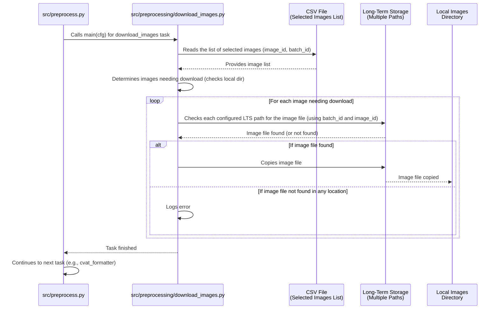

# Chapter 5: Image Retrieval

Welcome back to the `SemiF-PlantDetection` tutorial! In our previous chapters, we've learned how to configure the project ([Chapter 1](01_hydra_configuration_system_.md)), choose different workflows or modes ([Chapter 2](02_pipeline_modes_.md)), and locate important files and sensitive information ([Chapter 3](03_data_and_secrets_locations_.md)). Most recently, in [Chapter 4](04_data_selection_from_database_.md), we saw how the project queries the database to select *which* images and annotations are relevant for our task (like training).

Now, here's the challenge: the database selection gives us a *list* of image IDs and where they *should* be stored in the long-term archives, but it doesn't give us the actual image files themselves. Those files are often very large and stored on separate, high-capacity storage drives or network locations, not locally on the machine where you're running the project.

We need a way to fetch the actual image files corresponding to the list we generated in [Chapter 4](04_data_selection_from_database_.md) and bring them to a local working directory where the project can easily access them for further processing.

This is where the concept of **Image Retrieval** comes in.

Imagine the list of selected images from the database is like a shopping list of books you want to read. The actual books are stored in different large warehouses (your long-term storage locations). The **Image Retrieval** process is like a delivery service that takes your shopping list, goes to the specified warehouses, finds each book, and delivers them all to your local reading desk (your local working directory).

## What is Image Retrieval?

In the `SemiF-PlantDetection` project, **Image Retrieval** is a specific task within the `preprocess` pipeline mode. Its main job is to:

1.  Read the list of selected images generated by the [Data Selection from Database](04_data_selection_from_database_.md) task (typically a CSV file).
2.  For each image on the list, figure out its expected location in the long-term storage archives based on its metadata (like `batch_id`).
3.  Look in the configured long-term storage locations (`lts_locations`) to find the image file.
4.  Copy the found image file from the storage location to a specified local directory.
5.  Do this efficiently, potentially copying multiple images at the same time (in parallel) to speed up the process.

The output of this task is a folder on your local machine containing the actual image files you selected from the database.

## The Use Case: Getting Images for Processing

The central use case for Image Retrieval is obtaining the physical image files required by downstream tasks in the `preprocess` pipeline, such as preparing data for annotation tools like CVAT or structuring data for model training. You have the *information* about the images you want (from the database selection), and now you need the *images themselves*.

## How to Use Image Retrieval

Image retrieval is handled by the `download_images` task. This task is part of the default `preprocess` pipeline mode (as configured in `conf/preprocess/default.yaml`, which was loaded via `conf/config.yaml`'s defaults, as discussed in [Chapters 1](01_hydra_configuration_system_.md) and [2](02_pipeline_modes_.md)).

**1. Running the Task:**

Since `download_images` is a default task in the `preprocess` sequence, you typically run it simply by executing the `preprocess` mode:

```bash
python main.py mode=preprocess
```

Assuming the [Data Selection from Database](04_data_selection_from_database_.md) task (`training_dataset`) ran successfully and produced the necessary input CSV, the `preprocess` mode will automatically proceed to the `download_images` task.

If you wanted to run *only* the `download_images` task (useful if you already have the selection CSV but need to re-run the download), you could override the task list (referencing [Chapter 2](02_pipeline_modes_.md)):

```bash
python main.py mode=preprocess preprocess.tasks='[download_images]'
```

**2. Configuring Image Retrieval:**

The behavior of the `download_images` task is controlled by configuration settings, primarily found in two places:

*   **`conf/config.yaml` (under the `images` section):** This controls settings related to the output location and parallelization.

    ```yaml
    # conf/config.yaml
    # ... other settings ...

    images:
      output_path: ${paths.data_dir}/images # <-- Where downloaded images go
      parallel: true                      # <-- Enable parallel copying?
      parallel_workers: 16                # <-- How many copies at once?

    # ... more settings ...
    ```

    *   `images.output_path`: This setting determines the local directory where the downloaded image files will be saved. It uses interpolation (`${paths.data_dir}`) from the paths configuration ([Chapter 3](03_data_and_secrets_locations_.md)) to build the path relative to your project's data directory.
    *   `images.parallel`: Set this to `true` (default) to enable parallel downloading, which is much faster for many images. Set to `false` for sequential copying.
    *   `images.parallel_workers`: If `parallel` is `true`, this sets the maximum number of images to download concurrently. A higher number can be faster but uses more system resources (CPU, network bandwidth, disk I/O).

*   **`conf/paths/default.yaml` (the `lts_locations` list):** This tells the downloader *where* to look for the images.

    ```yaml
    # conf/paths/default.yaml
    # ... other paths ...

    # List of locations where original, long-term images might be stored
    lts_locations:
      - /mnt/research-projects/s/screberg/longterm_images
      - /mnt/research-projects/s/screberg/GROW_DATA
      - /mnt/research-projects/s/screberg/longterm_images2 # <-- Example paths

    # ... other paths ...
    ```

    *   `paths.lts_locations`: This is a *list* of file system paths. The downloader will look inside subdirectories within each of these paths to find the required images. The paths should point to the base directories containing the `semifield-developed-images` structure (which contains the batch folders, etc.).

You can override these settings from the command line using Hydra's `key=value` syntax ([Chapter 1](01_hydra_configuration_system_.md)):

```bash
# Example: Download images sequentially instead of parallel
python main.py mode=preprocess images.parallel=false

# Example: Change the local output directory
python main.py mode=preprocess images.output_path='/tmp/my_downloads'

# Example: Specify different long-term storage locations (overrides the default list)
# Note: Overriding a list requires specific syntax depending on your shell/Hydra version.
# A simpler way is often to create a custom paths config file and override 'paths'.
# E.g., python main.py mode=preprocess paths=my_local_lts
# (where conf/paths/my_local_lts.yaml contains your desired lts_locations list)
```

**3. Inputs and Outputs:**

*   **Input:** The primary input is the CSV file generated by the [Data Selection from Database](04_data_selection_from_database_.md) task (e.g., `data/training_selection/YYYY-MM-DD/HH-MM-SS/training_images.csv`). This file contains the `image_id` and `batch_id` needed to locate the source files. The downloader automatically finds the most recent such file based on the `cfg.database.dataset.output_path` setting.
*   **Output:** The output is the collection of actual image files (e.g., `image_id.jpg` files) copied into the local directory specified by `cfg.images.output_path`.

## How Image Retrieval Works (Under the Hood)

Let's see how the `download_images` task (`src.preprocessing.download_images.py`) achieves this.

**1. Orchestration by `preprocess` Mode:**

As covered in [Chapter 2](02_pipeline_modes_.md), when the `preprocess` mode runs, it iterates through its configured tasks. When it reaches `"download_images"`, it calls the corresponding function from its `TASK_REGISTRY`, which is `src.preprocessing.download_images.main(cfg)`.



**2. Inside the `download_images` Task:**

The `src.preprocessing.download_images.main(cfg)` function creates an instance of the `ImageDownloader` class, passing it the full configuration `cfg`.

```python
# Simplified snippet from src/preprocessing/download_images.py
def main(cfg: DictConfig) -> None:
    # The main function for this task receives the full config (cfg)
    log.info("Starting copying images locally...")
    downloader = ImageDownloader(cfg) # Create the downloader instance
    downloader.download_all_images()  # Run the download process
    log.info("Copying images process completed.")

# Inside the ImageDownloader class...
class ImageDownloader:
    def __init__(self, cfg: DictConfig) -> None:
        # Get necessary paths from config
        self.image_download_folder = Path(cfg.images.output_path) # Local output
        self.storage_bases = []
        for lts_location in cfg.paths.lts_locations: # List of LTS locations
            # Construct the expected subdirectory structure within LTS
            self.storage_bases.append(Path(lts_location, "semifield-developed-images"))
            
        # Get parallel settings from config
        self.max_workers = cfg.images.parallel_workers
        self.parallel = cfg.images.parallel
        
        # Automatically find the most recent input CSV
        csv_base_path = Path(cfg.database.dataset.output_path)
        self.dataset_path = find_most_recent_dataset_path(csv_base_path) # Utility function
        self.csv_file_path = Path(self.dataset_path, "training_images.csv")

        # Create local output directory if it doesn't exist
        self.image_download_folder.mkdir(parents=True, exist_ok=True)

    # ... other methods ...
```

Inside the `ImageDownloader` class:
*   **Initialization (`__init__`)**: It gets all the required configuration values (`output_path`, `lts_locations`, `parallel`, `parallel_workers`) from the `cfg` object. It also automatically finds the path to the most recent input CSV file generated by the previous task using a utility function (`find_most_recent_dataset_path`).
*   **Loading the Input:** The `load_dataset` method reads the selected image list from the CSV file using Pandas (`pd.read_csv`).

    ```python
    # Inside ImageDownloader class (simplified)
    def load_dataset(self) -> pd.DataFrame:
        try:
            df = pd.read_csv(self.csv_file_path) # Read the CSV
            log.info(f"Loaded dataset from {self.csv_file_path}")
            return df
        except FileNotFoundError:
            log.error(f"CSV file not found: {self.csv_file_path}")
            raise # Stop if input is missing
        # ... error handling ...
    ```
*   **Identifying Images to Download:** The `get_unique_images` method reads the DataFrame and checks if each image (`image_id.jpg`) already exists in the local `self.image_download_folder`. It returns a list containing only the `batch_id` and `image_id` for images that *need* to be downloaded. This prevents unnecessary copying if you run the task again.
*   **Downloading Individual Images:** The core logic is in the `download_image` method. For a given `batch_id` and `image_id`, it constructs the full expected path in each of the `lts_locations` configured. It then tries each path: if the file exists, it copies it to the local destination path using `shutil.copy`. If the file isn't found in any specified location, it logs an error.

    ```python
    # Inside ImageDownloader class (simplified download_image method)
    def download_image(self, batch_id: str, image_id: str) -> None:
        image_filename = f"{image_id}.jpg"
        local_image_path = Path(self.image_download_folder, image_filename) # Local target

        if local_image_path.exists():
            log.debug(f"Image already exists: {image_id}")
            return # Skip if already downloaded

        # Check each potential source location from config
        for storage_base in self.storage_bases:
            # Construct the expected source path structure
            storage_path = Path(storage_base, batch_id, "images", image_filename) 
            if storage_path.exists():
                try:
                    shutil.copy(storage_path, local_image_path) # The actual copy!
                    log.debug(f"Downloaded {image_id} from {storage_path}")
                    return # Found and copied, stop checking locations for this image
                except IOError as e:
                    log.error(f"Error copying {storage_path}: {e}")
                    # Continue to next storage location if copy fails
        
        # If loop finishes without returning, image wasn't found/copied anywhere
        log.error(f"Image not found in any storage for {image_id} (batch {batch_id})")
    ```
*   **Parallel vs. Sequential:** The `download_all_images` method orchestrates the downloads. If `cfg.images.parallel` is `True`, it uses `ThreadPoolExecutor` to call the `download_image` method for many images concurrently, up to `cfg.images.parallel_workers`. Otherwise, it simply loops through the images sequentially.

This task effectively bridges the gap between the database information and the actual image files, making them available locally for the next steps in the pipeline.

## Conclusion

In this chapter, we learned about **Image Retrieval**:
*   It's the task (`download_images`) responsible for copying selected image files from long-term storage to a local working directory.
*   It's typically run as part of the `preprocess` pipeline mode, using the list of images generated by the [Data Selection from Database](04_data_selection_from_database_.md) task as its input.
*   You configure where images are stored (`cfg.paths.lts_locations`), where they should be copied locally (`cfg.images.output_path`), and whether to use parallel copying (`cfg.images.parallel` and `cfg.images.parallel_workers`).
*   The task loads the list of images, checks which ones are missing locally, finds them in the configured storage locations, and copies them over, handling potential parallel execution.

Now that we have the images on our local machine, along with the annotation information we selected from the database in [Chapter 4](04_data_selection_from_database_.md), the next crucial step is to prepare this data for use with annotation tools like CVAT or directly for training.

[Next Chapter: CVAT Data Preparation & Import](06_cvat_data_preparation___import_.md)

---

Generated by [AI Codebase Knowledge Builder](https://github.com/The-Pocket/Tutorial-Codebase-Knowledge)