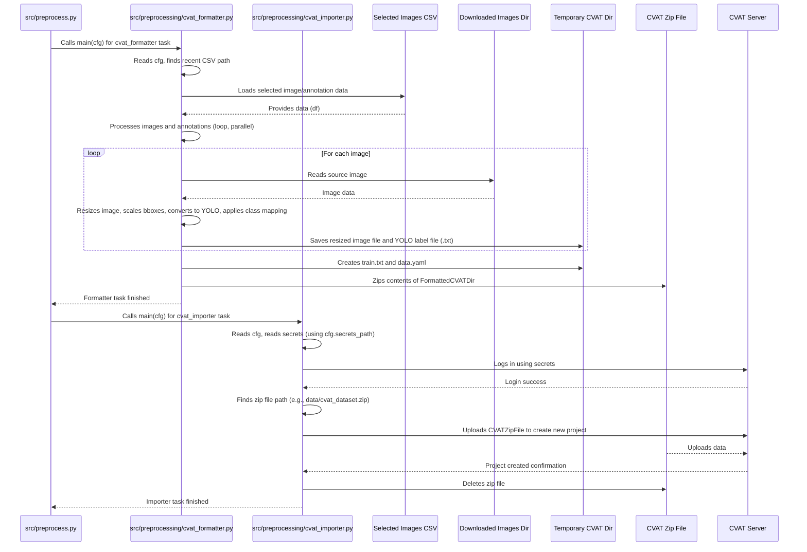

# Chapter 6: CVAT Data Preparation & Import

Welcome back to the `SemiF-PlantDetection` tutorial! In our journey so far:
*   We mastered the [Hydra Configuration System](01_hydra_configuration_system_.md) ([Chapter 1](01_hydra_configuration_system_.md)) to manage project settings.
*   We understood [Pipeline Modes](02_pipeline_modes_.md) ([Chapter 2](02_pipeline_modes_.md)) and how the project switches between workflows like `preprocess` and `train`.
*   We learned about [Data and Secrets Locations](03_data_and_secrets_locations_.md) ([Chapter 3](03_data_and_secrets_locations_.md)), finding where data lives and how secrets are handled.
*   We saw how the project uses [Data Selection from Database](04_data_selection_from_database_.md) ([Chapter 4](04_data_selection_from_database_.md)) to choose which images and annotations are relevant.
*   And in [Chapter 5](05_image_retrieval_.md), we covered [Image Retrieval](05_image_retrieval_.md), the process of fetching the actual image files from storage based on that selection.

Now, we have a list of images and their automatically generated (or previously human-annotated) bounding boxes and class information, and we also have the actual image files downloaded locally. This is great! But often, automatically generated annotations aren't perfect, or you might want to add new annotations manually.

To do this, we need to get this data into a tool designed for manual annotation, like **CVAT** (Computer Vision Annotation Tool). CVAT is a popular open-source platform for annotating images and videos for computer vision tasks.

However, CVAT needs the data in a very specific format, and the raw images and annotations from our database aren't directly ready. Also, the original images might be *very* large, making annotation slow and cumbersome in a web tool.

This is where **CVAT Data Preparation & Import** comes in.

Imagine you've gathered all the ingredients for a meal (your selected images and annotation data) and decided you want a professional chef (CVAT) to help you prepare parts of it. You can't just send the raw ingredients in a chaotic box. You need to clean them, maybe chop some vegetables, package them nicely, and send them with clear instructions to the chef's kitchen.

The **CVAT Data Preparation & Import** process is like packaging your selected images and annotations, preparing them in a specific format that CVAT understands, making them smaller and easier to handle, and then sending them to the CVAT server.

## What is CVAT Data Preparation & Import?

In the `SemiF-PlantDetection` project, **CVAT Data Preparation & Import** is a set of tasks within the `preprocess` pipeline mode. Their primary goals are:

1.  **Format Data:** Convert the selected image/annotation data (from the database and downloaded images) into a specific format required by CVAT for importing datasets. This project uses the **Ultralytics YOLO Detection 1.0** format.
2.  **Prepare Images:** If necessary, resize the large original images to a more manageable size for web-based annotation in CVAT.
3.  **Convert Annotations:** Adjust the coordinates of the bounding boxes to match the new, potentially resized image dimensions, and convert the bounding box format to the required YOLO format (`[class_id, center_x, center_y, width, height]`, normalized).
4.  **Structure Data:** Organize the resized images and formatted annotation files (`.txt` files) into the specific directory structure expected by the YOLO format.
5.  **Create Metadata:** Generate necessary configuration files (like `data.yaml` and `train.txt`) that describe the dataset and its classes to CVAT.
6.  **Package:** Compress all the prepared files (images, annotations, config files) into a single `.zip` archive.
7.  **Upload:** Connect to a CVAT server and upload the created zip archive to create a new annotation project.

This prepares a clean, standardized dataset ready for manual work by annotators in CVAT.

## The Use Case: Preparing Data for Manual Annotation in CVAT

The central use case is simple: **get your curated subset of images and their existing annotations into CVAT so that human annotators can review, correct, and potentially add annotations.** This is crucial for improving the quality of your training data.

## How to Use CVAT Data Preparation & Import

This process is handled by two specific tasks in the `preprocess` pipeline: `cvat_formatter` and `cvat_importer`.

**1. Running the Tasks:**

These tasks are part of the default `preprocess` pipeline mode (defined in `conf/preprocess/default.yaml`). Assuming you've run the previous steps (Data Selection, Image Retrieval) within the `preprocess` mode, these tasks will run automatically.

So, you typically run it by executing the `preprocess` mode:

```bash
python main.py mode=preprocess
```

The `preprocess` mode will execute tasks in order: `training_dataset` -> `download_images` -> `cvat_formatter` -> `cvat_importer`.

If you needed to re-run *only* the formatting and import (e.g., after tweaking the resize factor), you could override the task list (referencing [Chapter 2](02_pipeline_modes_.md)):

```bash
python main.py mode=preprocess preprocess.tasks='[cvat_formatter, cvat_importer]'
```

**2. Configuring CVAT Data Preparation & Import:**

The behavior of these tasks is controlled by the configuration settings, primarily in the `cvat` section of `conf/config.yaml`:

```yaml
# conf/config.yaml
# ... other settings ...

# used mainly in cvat_formatter and cvat_importer
cvat:
  output_path: ${paths.data_dir}/cvat_dataset # <-- Temporary output directory
  default_image_width: 9560                 # <-- Default dimensions (less critical if resizing)
  default_image_height: 6368
  resize_factor: 0.75                       # <-- Factor to resize images (e.g., 0.75 means 75% size)
  parallel: true                            # <-- Use parallel processing for image resize/format?
  parallel_workers: 16                      # <-- How many workers for parallel processing?
  class_mapping:                            # <-- Mapping from database classes to CVAT classes
    plant: 0
    non_target: 1
    color_checker: 2
  dataset_format: "Ultralytics YOLO Detection 1.0" # <-- The target format name

# configure credentials
secrets_path: ${paths.secrets_dir}/default.yaml # <-- Path to secrets (needed by importer)

# ... more settings ...
```

*   `cvat.output_path`: This is a temporary directory where the `cvat_formatter` task builds the dataset structure (images, labels, config files) before it's zipped.
*   `cvat.resize_factor`: This is a crucial setting. If your original images are huge, setting this to a value less than 1.0 (like 0.75 or 0.5) will scale down the images. This makes them much faster to load and annotate in the CVAT web interface. The bounding box coordinates will be automatically scaled down proportionally.
*   `cvat.parallel`, `cvat.parallel_workers`: These settings control whether the image resizing and annotation file generation is done in parallel, which significantly speeds up the process when handling many images.
*   `cvat.class_mapping`: This defines how the potentially complex class information from the database (like specific species IDs) is mapped to the simpler classes you want to annotate in CVAT (like just "plant", "non_target", "color_checker"). The keys are the desired CVAT class names, and the values are the integer class IDs expected by the YOLO format (starting from 0).
*   `cvat.dataset_format`: The name of the specific format the exporter creates. This name is used by the `cvat_importer` when telling the CVAT server what format to expect in the zip file.
*   `secrets_path`: As discussed in [Chapter 3](03_data_and_secrets_locations_.md), this points to your secrets file (e.g., `secrets/default.yaml`). The `cvat_importer` needs this file to get the URL, username, and password to log in to your CVAT server. Your `secrets/default.yaml` must contain a `cvat` section like:

    ```yaml
    # secrets/default.yaml (YOU CREATE THIS FILE)
    cvat:
      url: http://your-cvat-server.com # Or localhost:8080
      username: your_cvat_user
      password: your_cvat_password_safe
    ```

You can override these settings from the command line:

```bash
# Example: Resize images to 50% size
python main.py mode=preprocess cvat.resize_factor=0.5

# Example: Change the class mapping for 'non_target'
python main.py mode=preprocess cvat.class_mapping.non_target=5
```

**3. Inputs and Outputs:**

*   **Inputs:**
    *   The CSV file listing selected images and their annotations, generated by the [Data Selection from Database](04_data_selection_from_database_.md) task (found via `cfg.database.dataset.output_path` and utility function `find_most_recent_dataset_path`).
    *   The actual image files downloaded locally by the [Image Retrieval](05_image_retrieval_.md) task (found via `cfg.images.output_path`).
*   **Outputs:**
    *   A temporary directory containing the formatted dataset structure (`cfg.cvat.output_path`).
    *   A `.zip` archive containing the formatted dataset (e.g., `data/cvat_dataset.zip`).
    *   A new project created on your configured CVAT server with the uploaded data. The zip file is deleted after successful upload.

## How CVAT Data Preparation & Import Works (Under the Hood)

Let's trace the steps when the `preprocess` mode runs these tasks.

**1. Orchestration by `preprocess` Mode:**

As seen in [Chapter 2](02_pipeline_modes_.md), the `preprocess` mode function (`src.preprocess.main`) executes tasks listed in `cfg.preprocess.tasks`. When it hits `"cvat_formatter"`, it calls `src.preprocessing.cvat_formatter.main(cfg)`. After that task finishes, it proceeds to `"cvat_importer"` and calls `src.preprocessing.cvat_importer.main(cfg)`.



**2. Inside the `cvat_formatter` Task (`src/preprocessing/cvat_formatter.py`):**

The `main` function for the formatter is straightforward:

```python
# src/preprocessing/cvat_formatter.py (Simplified main)
def main(cfg: DictConfig) -> None:
    log.info("Starting CVAT formatter task")
    formatter = CVATFormatter(cfg) # Initialize the formatter
    # formatter.cleanup() # Optional: clean up previous runs
    formatter.format_for_cvat() # Do the main work
    # formatter.cleanup() # Optional: clean up temp directory after zipping
    log.info("CVAT formatter task completed")
```

The core logic is within the `CVATFormatter` class:

*   **Initialization (`__init__`)**: It reads configurations like input CSV path (using `find_most_recent_dataset_path` from `src/utils/utils.py`), image source path (`cfg.images.output_path`), target CVAT output path (`cfg.cvat.output_path`), resize factor, parallel settings, and the all-important `class_mapping`. It also sets up the target directory structure (`images/train`, `labels/train`).

    ```python
    # src/preprocessing/cvat_formatter.py (Simplified __init__)
    class CVATFormatter:
        def __init__(self, cfg: DictConfig) -> None:
            # Get paths and settings from cfg
            self.csv_file_path = Path(find_most_recent_dataset_path(cfg.database.dataset.output_path), "training_images.csv")
            self.image_source_folder = Path(cfg.images.output_path)
            self.cvat_output_folder = Path(cfg.cvat.output_path)
            self.images_dir = self.cvat_output_folder / "images" / "train"
            self.labels_dir = self.cvat_output_folder / "labels" / "train"
            self.resize_factor = cfg.cvat.get('resize_factor', 1.0)
            self.class_mapping = cfg.cvat.class_mapping
            self.parallel = cfg.cvat.get('parallel', False)
            # ... set up directories ...
            self.images_dir.mkdir(parents=True, exist_ok=True)
            self.labels_dir.mkdir(parents=True, exist_ok=True)
            # ... other initializations ...
    ```
*   **`format_for_cvat` Method**: This method orchestrates the steps: load the dataset CSV, determine class names from the configured mapping, process each image (either sequentially or in parallel), create `train.txt`, create `data.yaml`, and create the final zip archive.

    ```python
    # src/preprocessing/cvat_formatter.py (Simplified format_for_cvat)
    def format_for_cvat(self) -> None:
        log.info("Starting CVAT formatting process")
        df = self.load_dataset() # Load the data
        class_names = self.get_unique_class_ids(df) # Get names from mapping

        if self.parallel:
            # Use multiprocessing pool to process images in parallel
            pass # Simplified
        else:
            # Process images one by one
            for _, row in df.iterrows():
                self.process_image(row)

        self.create_train_txt()
        self.create_data_yaml(class_names)
        self.create_zip_archive()
        log.info("CVAT formatting completed")
    ```
*   **`process_image` Method**: This is the core per-image logic. It reads the source image (from `cfg.images.output_path`), resizes it using `cv2.resize`, and saves the resized image to the temporary CVAT directory. Then, it reads the annotation JSON string from the DataFrame row, iterates through each bounding box, *scales* the bounding box coordinates according to the `resize_factor`, applies the configured `class_mapping` (e.g., mapping a specific species ID to `cfg.cvat.class_mapping.plant`), converts the scaled bounding box coordinates to the YOLO format (`[class_id, center_x, center_y, width, height]` normalized using the *resized* image dimensions) using the `convert_bbox_to_yolo_format` utility function, and writes the resulting line to an annotation `.txt` file in the temporary labels directory.

    ```python
    # src/preprocessing/cvat_formatter.py (Simplified process_image)
    def process_image(self, row: pd.Series) -> None:
        image_id = row['image_id']
        source_image_path = self.image_source_folder / f"{image_id}.jpg"
        dest_image_path = self.images_dir / f"{image_id}.jpg"

        # Load and resize image using OpenCV (cv2)
        image = cv2.imread(str(source_image_path))
        # ... check if image loaded ...
        original_height, original_width = image.shape[:2]
        new_width = int(original_width * self.resize_factor)
        new_height = int(original_height * self.resize_factor)
        resized_image = cv2.resize(image, (new_width, new_height), interpolation=cv2.INTER_AREA)
        cv2.imwrite(str(dest_image_path), resized_image) # Save resized image

        # Parse annotations from CSV row
        annotations = json.loads(row['annotations'])
        annotation_file_path = self.labels_dir / f"{image_id}.txt"

        with open(annotation_file_path, 'w') as f:
            for annotation in annotations:
                bbox = annotation.get('bbox_xywh') # [x, y, width, height]
                if not bbox: continue

                # Scale bbox coordinates based on resize factor
                scaled_bbox = [int(coord * self.resize_factor) for coord in bbox]

                # Apply class mapping from config based on annotation data
                mapped_class_id = self.class_mapping.plant # Default
                if annotation.get('non_target_weed') is True:
                    # Check confidence for non-target, maybe map to plant if low confidence
                    mapped_class_id = self.class_mapping.non_target
                elif annotation.get('category_class_id') == 28: # Example: Color checker class
                    mapped_class_id = self.class_mapping.color_checker
                # ... other mapping rules ...

                # Convert scaled bbox to YOLO format [class_id, center_x, center_y, width, height] (normalized)
                center_x, center_y, norm_width, norm_height = convert_bbox_to_yolo_format(
                    scaled_bbox, new_width, new_height # Use NEW dimensions for normalization
                )

                # Write line to label file
                f.write(f"{mapped_class_id} {center_x:.6f} {center_y:.6f} {norm_width:.6f} {norm_height:.6f}\n")

        log.debug(f"Processed image {image_id} (resized to {new_width}x{new_height})")

    # Utility function used:
    # src/utils/utils.py (Simplified convert_bbox_to_yolo_format)
    def convert_bbox_to_yolo_format(bbox, image_width, image_height):
        """Convert [x, y, w, h] (top-left) to [center_x, center_y, w, h] (normalized)."""
        x, y, width, height = bbox
        center_x = (x + width / 2) / image_width
        center_y = (y + height / 2) / image_height
        normalized_width = width / image_width
        normalized_height = height / image_height
        return [center_x, center_y, normalized_width, normalized_height]
    ```
*   **`create_train_txt` and `create_data_yaml`**: These methods create the required metadata files. `train.txt` simply lists the relative paths to each image file in the `images/train` directory. `data.yaml` is a simple YAML file specifying the path (`./`), the training image list file (`train.txt`), and the class names based on the `class_mapping`.
*   **`create_zip_archive`**: This method zips up the entire temporary CVAT output directory (`cfg.cvat.output_path`) into a single zip file (e.g., `data/cvat_dataset.zip`) one level up from the output directory.

**3. Inside the `cvat_importer` Task (`src/preprocessing/cvat_importer.py`):**

The `main` function for the importer is also concise:

```python
# src/preprocessing/cvat_importer.py (Simplified main)
def main(cfg: DictConfig) -> None:
    log.info("Starting CVAT dataset uploader")
    cvat_importer = CVATImporter(cfg) # Initialize importer
    cvat_importer.login()             # Log in to CVAT server
    project_name = cvat_importer.create_project() # Create project and upload zip
    log.info(f"CVAT project created: {project_name}")
```

The logic is within the `CVATImporter` class:

*   **Initialization (`__init__`)**: Reads necessary configuration from `cfg`, including the `secrets_path` to get CVAT credentials using the `read_secrets` utility function. It also determines the expected path of the zip file created by the formatter.

    ```python
    # src/preprocessing/cvat_importer.py (Simplified __init__)
    class CVATImporter:
        def __init__(self, cfg: DictConfig) -> None:
            self.cfg = cfg
            # Use utility function to read secrets from the file specified in config
            all_secrets = read_secrets(cfg.secrets_path)
            self.cvat_secrets = all_secrets['cvat'] # Get the 'cvat' section

            self.cvat_dataset_format = cfg.cvat.dataset_format
            # Construct the expected zip path based on cvat.output_path
            self.zip_path = Path(cfg.cvat.output_path).parent / f"{Path(cfg.cvat.output_path).name}.zip"
            log.info(f"Expecting CVAT zip file at: {self.zip_path}")
    ```
*   **`login` Method**: Uses the `cvat_sdk` library to create a client instance pointing to the CVAT server URL from secrets and logs in using the username and password from secrets.

    ```python
    # src/preprocessing/cvat_importer.py (Simplified login)
    def login(self):
        """Login to CVAT using credentials from secrets."""
        try:
            # Initialize CVAT client with server URL from secrets
            self.cvat_client = Client(self.cvat_secrets['url'])
            # Login using username and password from secrets
            self.cvat_client.login(credentials=[self.cvat_secrets['username'], self.cvat_secrets['password']])
            log.info("Successfully logged into CVAT.")
        except Exception as e:
            log.error(f"Failed to log into CVAT: {e}")
            raise # Stop if login fails
    ```
*   **`create_project` Method**: This method creates the new project on CVAT. It first generates a project name based on the date and time of the dataset selection (again using `find_most_recent_dataset_path`). Then, it uses the `cvat_sdk.Client.projects.create_from_dataset` method, providing the project name, the path to the zip file, and the `dataset_format` string from the configuration. This single method handles the upload and project creation on the CVAT server.

    ```python
    # src/preprocessing/cvat_importer.py (Simplified create_project)
    def create_project(self) -> str:
        """Create a new CVAT project using the generated zip dataset."""
        # Determine project name based on dataset creation time
        dataset_info_path = find_most_recent_dataset_path(self.cfg.database.dataset.output_path)
        project_name = f"Plant detection {dataset_info_path.parent.name} ({dataset_info_path.name})" # Example name

        log.info(f"Creating CVAT project '{project_name}' from dataset '{self.zip_path}'...")
        try:
            # Use CVAT SDK to create a project and upload the dataset
            project_spec = models.ProjectWriteRequest(name=project_name)
            self.cvat_client.projects.create_from_dataset(spec=project_spec,
                                                          dataset_path=str(self.zip_path),
                                                          dataset_format=self.cvat_dataset_format)
            log.info(f"Successfully created CVAT project: {project_name}")
            return project_name
        except Exception as e:
            log.error(f"Failed to create CVAT project: {e}")
            raise # Stop if project creation/upload fails
    ```
*   **`__del__` Method**: This is a special "destructor" method that automatically runs when the `CVATImporter` object is no longer needed (e.g., when the `main` function finishes). Its purpose is to clean up and delete the zip file that was created and uploaded, as it's no longer needed locally.

    ```python
    # src/preprocessing/cvat_importer.py (Simplified __del__)
    def __del__(self):
        """Delete the local zip file after upload."""
        try:
            if self.zip_path.exists():
                self.zip_path.unlink() # Delete the file
                log.info(f"Deleted CVAT dataset zip file: {self.zip_path}")
        except Exception as e:
            log.error(f"Error deleting CVAT dataset zip file: {e}")
    ```

Together, these two tasks (`cvat_formatter` and `cvat_importer`) automate the entire process of taking the selected raw data, transforming it into a CVAT-friendly format, packaging it, and getting it onto the CVAT server, ready for human review and annotation.

## Conclusion

In this chapter, we learned about **CVAT Data Preparation & Import**:
*   It's a set of tasks (`cvat_formatter`, `cvat_importer`) within the `preprocess` pipeline mode.
*   Its purpose is to prepare selected images and annotations for manual annotation in CVAT.
*   Key steps include resizing images, scaling and converting bounding box coordinates to YOLO format, applying class mapping, structuring files, zipping the data, and uploading it to a CVAT server.
*   You configure the process via the `cvat` section in `conf/config.yaml` (output path, resize factor, parallel processing, class mapping) and ensure your CVAT credentials are in your secrets file (referenced by `cfg.secrets_path`).
*   The tasks use libraries like OpenCV (`cv2`) for image processing and `cvat_sdk` for interacting with the CVAT server.
*   Utility functions like `find_most_recent_dataset_path` and `convert_bbox_to_yolo_format` (from `src/utils/utils.py`) are used internally.

You now have the data selected from the database, images retrieved from storage, and this data is formatted and uploaded to CVAT for potential manual refinement. After the annotation work is done in CVAT and exported (a manual step outside this project's scope), the project needs to take that *final* annotation data and structure it correctly for the next phase: training a machine learning model.

[Next Chapter: Training Data Structuring](07_training_data_structuring_.md)

---

Generated by [AI Codebase Knowledge Builder](https://github.com/The-Pocket/Tutorial-Codebase-Knowledge)