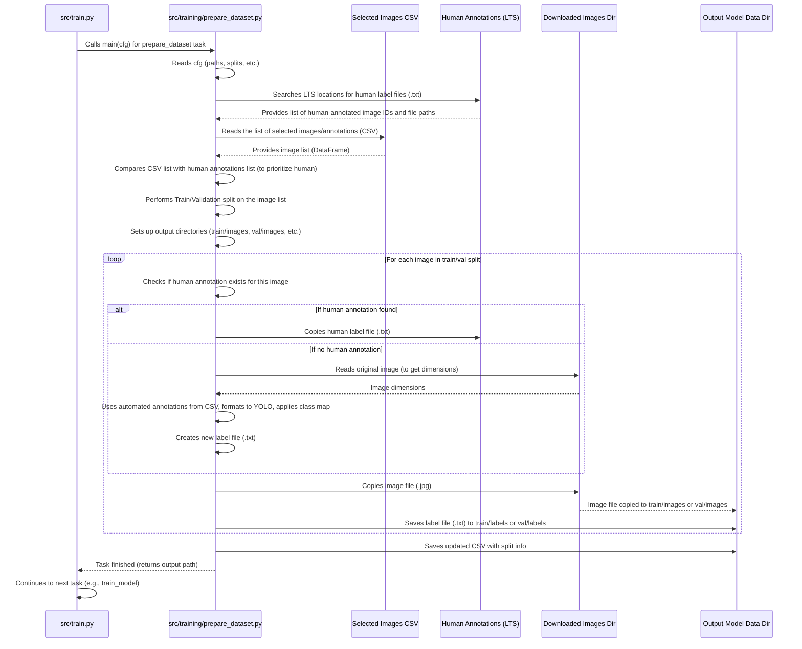

# Chapter 7: Training Data Structuring

Welcome back to the `SemiF-PlantDetection` tutorial! In the journey so far:
*   We learned how the [Hydra Configuration System](01_hydra_configuration_system_.md) helps us manage project settings.
*   We explored [Pipeline Modes](02_pipeline_modes_.md) to switch between workflows like `preprocess` and `train`.
*   We covered [Data and Secrets Locations](03_data_and_secrets_locations_.md) for finding files and handling secrets.
*   We saw how [Data Selection from Database](04_data_selection_from_database_.md) picks the relevant images and annotations.
*   We retrieved the actual image files using [Image Retrieval](05_image_retrieval_.md).
*   And we prepared this data for potential manual refinement in CVAT using [CVAT Data Preparation & Import](06_cvat_data_preparation___import_.md).

Now, imagine you've done some manual annotation work in CVAT (if needed) and exported your final, high-quality annotations. Or perhaps you're just using the automatically generated annotations combined with the retrieved images. Either way, you have your collection of images and their corresponding annotation information.

The next big step is training a machine learning model (like YOLO) to detect plants. But machine learning frameworks are very specific about how you organize your training data. They need images and their label files to be in a particular directory structure, often separated into folders for training and validation data.

This is where the concept of **Training Data Structuring** comes in.

Imagine you're a student preparing for a big exam. You have all your notes, textbooks, and practice questions scattered around (your images and annotations). To study effectively, you need to organize everything neatly. You might put all your notes for Subject A in one pile ("Training Data") and some practice questions for Subject A in another pile ("Validation Data"). Within each pile, you need your study materials sorted in a way the "exam" (the training algorithm) expects.

The **Training Data Structuring** process is like taking your collected images and annotations and sorting them into these neat, structured piles, ready for the model to "study" and learn from. It takes your selected images and annotation data, makes sure the annotations are in the correct format (like YOLO), decides which images go into the "training" pile and which into the "validation" pile, and organizes them into the exact directory structure required by the training framework. It also makes sure to use human annotations if they are available, as they are typically higher quality than automated ones.

## What is Training Data Structuring?

In the `SemiF-PlantDetection` project, **Training Data Structuring** is a specific task within the `train` pipeline mode. Its primary goal is to:

1.  **Gather Inputs:** Take the list of selected images/annotations (generated by [Data Selection from Database](04_data_selection_from_database_.md)), the downloaded images (from [Image Retrieval](05_image_retrieval_.md)), and crucially, check for **human-annotated label files** (e.g., from CVAT exports) for these images in specified long-term storage locations.
2.  **Prioritize Human Labels:** If a human-annotated label file exists for an image, use *that* file. If not, use the automatically generated annotation data that came from the database selection CSV.
3.  **Format Annotations:** Ensure all label data (whether from a human file or automated data) is in the required format for the training framework (e.g., Ultralytics YOLO format: `[class_id, center_x, center_y, width, height]` normalized, one line per object in a `.txt` file). If using automated data, this involves reading the original image dimensions and applying configured class mapping ([Chapter 6: CVAT Data Preparation & Import](06_cvat_data_preparation___import_.md)).
4.  **Split Data:** Divide the selected images and their corresponding label files into two sets: one for training (`train`) and one for validation (`val`). This split is essential for evaluating how well the model is learning during training.
5.  **Structure Directories:** Create a specific directory structure (like `train/images`, `train/labels`, `val/images`, `val/labels`) and copy the image files and formatted label files into the correct subdirectories within this structure.
6.  **Create Metadata:** Generate any simple metadata files (like a `data.yaml` file that tells the training framework where to find the images/labels and what the class names are) that the training framework needs. (Note: While `prepare_dataset` sets up the structure, the `data.yaml` might be created slightly differently or assumed depending on the specific trainer task).

The output is a perfectly organized folder ready to be fed directly into a training script or command.

## The Use Case: Preparing Data for Model Training

The central use case for this concept is **getting your data into the exact layout needed to train a machine learning model.** This task is the direct precursor to the [Model Training](08_model_training_.md) task. You've selected, retrieved, and potentially refined your data; now you're making it machine-readable for training.

## How to Use Training Data Structuring

Training Data Structuring is handled by the `prepare_dataset` task. This task is part of the default `train` pipeline mode.

**1. Running the Task:**

The `prepare_dataset` task is listed in `conf/train/default.yaml` as one of the tasks to run in the `train` mode (as seen in [Chapter 2: Pipeline Modes](02_pipeline_modes_.md)).

```yaml
# conf/train/default.yaml
tasks: # <-- This list defines the tasks for train mode
  - prepare_dataset # <-- Here it is!
  - train_model

# ... other train config ...
```

So, you typically run it by executing the `train` mode:

```bash
python main.py mode=train
```

Assuming the inputs (the selected image CSV and downloaded images) are available from previous `preprocess` runs, the `train` mode will automatically proceed to the `prepare_dataset` task.

If you wanted to re-run *only* the data structuring (e.g., after changing the validation split ratio), you could override the task list (referencing [Chapter 2](02_pipeline_modes_.md)):

```bash
python main.py mode=train train.tasks='[prepare_dataset]'
```

**2. Configuring Training Data Structuring:**

The behavior of the `prepare_dataset` task is controlled by configuration settings found mainly in `conf/train/default.yaml` and `conf/paths/default.yaml`.

From `conf/train/default.yaml`:

```yaml
# conf/train/default.yaml
# ... other settings ...

# Random seed for reproducible split
random_seed: 42

# Percentage of data to use for validation (0.0 to 1.0)
validation_split: 0.2

# path to data saved in ultralytics format and also has the train/val split information
model_data: ${paths.data_dir}/model_data # <-- Output directory

# Parallel processing configuration for copying/processing
parallel: true
parallel_workers: 16

# ... more settings ...
```

*   `train.random_seed`: An integer that ensures the train/validation split is the same every time you run the task with the same data and settings.
*   `train.validation_split`: A number between 0.0 and 1.0 indicating the proportion of data to set aside for the validation set.
*   `train.model_data`: This defines the base output directory where the `train/` and `val/` folders will be created. It uses interpolation (`${paths.data_dir}`) from the paths configuration ([Chapter 3: Data and Secrets Locations](03_data_and_secrets_locations_.md)). A timestamped subdirectory will be created inside this path.
*   `train.parallel`, `train.parallel_workers`: These settings control whether the process of copying images and creating label files is done in parallel, which can speed things up.

From `conf/paths/default.yaml` (as loaded via `conf/config.yaml` defaults, see [Chapter 1](01_hydra_configuration_system_.md)):

```yaml
# conf/paths/default.yaml
# ... other paths ...

# List of locations where human annotations for LTS images are stored
lts_human_annotations:
  # - /Volumes/screberg/longterm_images2/semifield-database/plant-detection/annotations/
  - /mnt/research-projects/s/screberg/longterm_images2/semifield-database/plant-detection/annotations/ # <-- Where to find human labels

# ... other paths ...
```

*   `paths.lts_human_annotations`: This crucial setting tells the task where to look for directories containing exported human annotations (like the `images/` and `labels/` folders exported from CVAT in YOLO format). The task will search through subdirectories here to find `labels/*.txt` files.

Additionally, the task needs the `class_mapping` defined in the `cvat` section of `conf/config.yaml` (see [Chapter 6: CVAT Data Preparation & Import](06_cvat_data_preparation___import_.md)) to correctly interpret class IDs if it has to use automated annotations.

```yaml
# conf/config.yaml
# ... other settings ...

# used mainly in cvat_formatter and cvat_importer
cvat:
  # ... other cvat settings ...
  class_mapping:                            # <-- Mapping from database classes to training classes
    plant: 0
    non_target: 1
    color_checker: 2

# ... more settings ...
```

You can override these settings from the command line using Hydra's `key=value` syntax ([Chapter 1](01_hydra_configuration_system_.md)):

```bash
# Example: Use a 30% validation split
python main.py mode=train train.validation_split=0.3

# Example: Change the random seed for the split
python main.py mode=train train.random_seed=99

# Example: Turn off parallel processing for data structuring
python main.py mode=train train.parallel=false
```

**3. Inputs and Outputs:**

*   **Inputs:**
    *   The CSV file listing selected images and their annotations, generated by the [Data Selection from Database](04_data_selection_from_database_.md) task (found automatically via `cfg.database.dataset.output_path` and utility function `find_most_recent_dataset_path`).
    *   The actual image files downloaded locally by the [Image Retrieval](05_image_retrieval_.md) task (found via `cfg.images.output_path`).
    *   Human-annotated label files found in the directories listed in `cfg.paths.lts_human_annotations`.
*   **Outputs:**
    *   A new timestamped directory structure under `cfg.train.model_data` (e.g., `data/model_data/YYYY-MM-DD/HH-MM-SS/`).
    *   Subdirectories within the timestamped folder: `train/images/`, `train/labels/`, `val/images/`, `val/labels/`.
    *   Image files copied into the `train/images/` and `val/images/` folders.
    *   Formatted label files (`.txt`) copied (if human annotated) or created (if using automated data) and saved into the `train/labels/` and `val/labels/` folders.
    *   An updated copy of the input CSV file saved to the output directory, with an added column indicating whether each image was assigned to the 'train' or 'val' split.

## How Training Data Structuring Works (Under the Hood)

Let's see how the `prepare_dataset` task (`src/training/prepare_dataset.py`) accomplishes this organization.

**1. Orchestration by `train` Mode:**

As seen in [Chapter 2: Pipeline Modes](02_pipeline_modes_.md), the `train` mode function (`src.train.main`) executes tasks listed in `cfg.train.tasks`. When it encounters `"prepare_dataset"`, it looks up this name in its `TASK_REGISTRY` and calls the corresponding function, `src.training.prepare_dataset.main(cfg)`.



**2. Inside the `prepare_dataset` Task (`src/training/prepare_dataset.py`):**

The `main` function creates an instance of the `PrepareDataset` class and runs its `run` method:

```python
# src/training/prepare_dataset.py (Simplified main)
def main(cfg: DictConfig):
    log.info("Starting training dataset preparation")
    prepare_dataset = PrepareDataset(cfg) # Initialize the preparer
    dataset_path = prepare_dataset.run()  # Run the preparation process
    log.info(f"Dataset prepared at {dataset_path}")
    return dataset_path # Return the path for the next task (training)
```

The core logic is within the `PrepareDataset` class:

*   **Initialization (`__init__`)**: It reads paths (`lts_human_annotations` to find human labels, `database.dataset.output_path` to find the input CSV, `images.output_path` to find downloaded images, `train.model_data` for output), split settings (`validation_split`, `random_seed`), class mapping (`cvat.class_mapping`), and parallel settings. It calls `get_annotated_image_ids` (a utility function) to find all human-annotated label files in the specified LTS locations and stores their paths. It also finds the path to the most recent input CSV using `find_most_recent_dataset_path`. Finally, it creates the timestamped output directory.

    ```python
    # src/training/prepare_dataset.py (Simplified __init__)
    class PrepareDataset:
        def __init__(self, cfg: DictConfig):
            self.cfg = cfg
            # Find human annotations in LTS locations
            self.human_annotations = get_annotated_image_ids(self.cfg.paths.lts_human_annotations)
            # Find the path to the most recent selected images CSV
            self.dataset_path = find_most_recent_dataset_path(self.cfg.database.dataset.output_path)
            self.data_csv = self.dataset_path / 'training_images.csv'
            # Get class mapping for formatting labels if needed
            self.class_mapping = self.cfg.cvat.class_mapping

            # Get split and output settings from train config
            self.random_seed = self.cfg.train.random_seed
            self.validation_split = self.cfg.train.validation_split
            timestamp_date = datetime.now().strftime("%Y-%m-%d")
            timestamp_time = datetime.now().strftime("%H-%M-%S")
            self.train_data_path = Path(self.cfg.train.model_data) / timestamp_date / timestamp_time
            os.makedirs(self.train_data_path, exist_ok=True) # Create the output dir

            # ... parallel config ...
            log.info(f"Found {len(self.human_annotations)} human annotations")
    ```
*   **`identify_training_data` Method**: This method reads the input CSV. It iterates through the images listed and checks if a human annotation exists for each. It performs the train/validation split using `sklearn.model_selection.train_test_split` based on the configured `validation_split` and `random_seed`. It adds a 'split' column to the DataFrame indicating 'train' or 'val' for each image and saves this updated DataFrame to the output directory.

    ```python
    # src/training/prepare_dataset.py (Simplified identify_training_data)
    def identify_training_data(self):
        df = pd.read_csv(self.data_csv)
        # Note: The self.human_annotations check is done later in process_image

        # Split image IDs into train and validation sets
        train_ids, val_ids = train_test_split(
            df['image_id'].tolist(),
            test_size=self.validation_split,
            random_state=self.random_seed, # For reproducibility
            shuffle=True
        )

        # Add a 'split' column to the DataFrame
        df['split'] = 'unused' # Default to unused
        df.loc[df['image_id'].isin(train_ids), 'split'] = 'train'
        df.loc[df['image_id'].isin(val_ids), 'split'] = 'val'

        # Save the updated DataFrame with split info
        output_path = self.train_data_path / f'train_images_{str(self.data_csv.parent.name)}_{str(self.data_csv.name)}.csv'
        df.to_csv(output_path, index=False)
        log.info(f"Split dataset into {len(train_ids)} training and {len(val_ids)} validation images")
        return df # Return the DataFrame with split info
    ```
*   **`structure_data` Method**: This method simply filters the DataFrame returned by `identify_training_data` into two parts (train and val) and calls `prepare_from_df` for each subset.

    ```python
    # src/training/prepare_dataset.py (Simplified structure_data)
    def structure_data(self, df):
        train_df = df.loc[df['split'] == 'train']
        val_df = df.loc[df['split'] == 'val']
        self.prepare_from_df(train_df, 'train') # Process training set
        self.prepare_from_df(val_df, 'val')   # Process validation set
    ```
*   **`prepare_from_df` Method**: This method sets up the `images/` and `labels/` directories within the target 'train' or 'val' output path. If parallel processing is enabled (`cfg.train.parallel`), it uses a `multiprocessing.Pool` to call `process_image_wrapper` (which calls `process_image`) for each image row. Otherwise, it loops sequentially and calls `process_image` directly.

    ```python
    # src/training/prepare_dataset.py (Simplified prepare_from_df)
    def prepare_from_df(self, df, type='train'): # type will be 'train' or 'val'
        # Create necessary subdirectories
        os.makedirs(self.train_data_path / type / 'images', exist_ok=True)
        os.makedirs(self.train_data_path / type / 'labels', exist_ok=True)

        if self.parallel:
            # Use a pool of workers for parallel processing
            # Creates a list of arguments (row, type) for each image
            args = [(row, type) for _, row in df.iterrows()]
            with Pool(processes=self.parallel_workers) as pool:
                pool.map(self.process_image_wrapper, args) # Map args to the wrapper function
        else:
            # Process images one by one
            for _, row in df.iterrows():
                self.process_image(row, type)
        
        log.info(f"Prepared {type} dataset with {len(df)} images")
    ```
*   **`process_image` Method**: This is the core function for handling a single image row from the DataFrame.
    *   It determines the source path of the image (from `cfg.images.output_path`) and the destination paths for the image and its label file in the output structure (`train/images`, `train/labels`, etc.).
    *   It copies the image file from the source to the destination.
    *   **This is where human labels are prioritized:** It checks if the image ID exists in the `self.human_annotations` dictionary.
        *   **If Yes:** It copies the human-annotated label file (`.txt`) found at the path stored in `self.human_annotations[image_id]` directly to the destination label path.
        *   **If No:** It means no human annotation was found for this image. It then reads the automated annotation data from the `row['annotations']`. It needs the *original* image dimensions (which it gets by reading the image file using `cv2.imread`) to normalize the bounding box coordinates. It parses the JSON annotations, applies the `class_mapping` from the configuration, converts the bounding box coordinates to the normalized YOLO format using the `convert_bbox_to_yolo_format` utility function, and writes these formatted bounding boxes to a new `.txt` file at the destination label path.

    ```python
    # src/training/prepare_dataset.py (Simplified process_image)
    def process_image(self, row, type): # type is 'train' or 'val'
        image_id = row['image_id']
        # Paths for source image and destination image/label
        source_image_path = Path(self.cfg.images.output_path) / f"{image_id}.jpg"
        dest_image_path = self.train_data_path / type / 'images' / f"{image_id}.jpg"
        dest_label_path = self.train_data_path / type / 'labels' / f"{image_id}.txt"

        # Copy image file
        if source_image_path.exists():
            shutil.copy(source_image_path, dest_image_path)
        else:
             log.warning(f"Image not found locally, skipping: {source_image_path}")
             return # Skip this image if not found locally

        # *** Prioritize Human Annotations ***
        if image_id in self.human_annotations.keys():
            # If human annotation found, copy the .txt file directly
            shutil.copy(self.human_annotations[image_id], dest_label_path)
            log.debug(f"Copied human label for {image_id}")
        else:
            # If NO human annotation, use automated data from CSV
            log.debug(f"Using automated label for {image_id}")
            if 'annotations' in row:
                try:
                    # Need image size to normalize automated bboxes
                    img = cv2.imread(str(source_image_path))
                    if img is None:
                         log.error(f"Unable to read image dimensions: {source_image_path}")
                         return # Skip if image can't be read for dimensions
                    image_height, image_width = img.shape[:2]

                    annotations = json.loads(row['annotations'])
                    with open(dest_label_path, 'w') as f:
                        for annotation in annotations:
                            bbox = annotation.get('bbox_xywh')
                            if not bbox: continue # Skip if no bbox

                            # Apply class mapping based on automated data
                            mapped_class_id = int(self.cfg.cvat.class_mapping.plant) # Default to 'plant'
                            if annotation.get('non_target_weed') is True:
                                # Example complex mapping: map non-target with low confidence to 'plant'
                                if annotation.get('non_target_weed_pred_conf', 0) > 0.99:
                                    mapped_class_id = int(self.cfg.cvat.class_mapping.non_target)
                            elif annotation.get('category_class_id') == 28: # Example: Color checker ID
                                mapped_class_id = int(self.cfg.cvat.class_mapping.color_checker)
                            # ... potentially other mapping rules ...

                            # Convert bbox to YOLO format [center_x, center_y, w, h] (normalized)
                            center_x, center_y, norm_width, norm_height = convert_bbox_to_yolo_format(
                                bbox, image_width, image_height # Use original image dimensions
                            )

                            # Write formatted line to label file
                            f.write(f"{mapped_class_id} {center_x:.6f} {center_y:.6f} {norm_width:.6f} {norm_height:.6f}\n")
                except (json.JSONDecodeError, TypeError, Exception) as e:
                     log.error(f"Error processing automated annotations for {image_id}: {e}")
                     # Decide if you want to raise error or just log and skip annotation file
            else:
                 log.warning(f"No automated annotations found for {image_id} (and no human label)")
                 # An empty label file will be created, which is valid for images with no objects
    ```

*   **`process_image_wrapper`**: A simple helper function needed for parallel processing using `multiprocessing.Pool`, it catches exceptions during parallel execution.
*   **`run` Method**: The main workflow method that calls `identify_training_data` and then `structure_data`.

This detailed process ensures that the training data is correctly formatted, includes the best available annotation source (human prioritized), and is organized into the precise train/validation structure needed by the training framework.

## Conclusion

In this chapter, we learned about **Training Data Structuring**:
*   It's the task (`prepare_dataset`) within the `train` pipeline mode that organizes images and labels for model training.
*   It takes selected images, downloaded image files, and looks for human-annotated label files in specified LTS locations.
*   It **prioritizes human annotations** if found; otherwise, it uses automated annotations from the database and formats them correctly (YOLO format, normalized coordinates, applying class mapping).
*   It splits the dataset into training and validation sets based on configured ratios and a random seed.
*   It creates the required directory structure (`train/images`, `train/labels`, `val/images`, `val/labels`) and copies/creates files within them.
*   You configure its behavior using settings in `conf/train/default.yaml` (split ratio, random seed, output path, parallel settings) and specify where to find human annotations in `conf/paths/default.yaml`. It also relies on the `cvat.class_mapping` from `conf/config.yaml`.

You now have your data perfectly structured and ready! The next step is to use this prepared dataset to train the machine learning model.

[Next Chapter: Model Training](08_model_training_.md)

---

Generated by [AI Codebase Knowledge Builder](https://github.com/The-Pocket/Tutorial-Codebase-Knowledge)