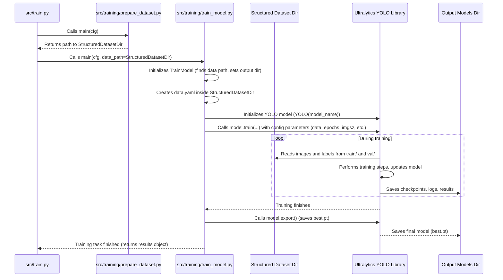

# Chapter 8: Model Training

Welcome back to the `SemiF-PlantDetection` tutorial! In our journey so far, we've gone through the crucial steps of preparing our data:
*   We used the [Hydra Configuration System](01_hydra_configuration_system_.md) ([Chapter 1](01_hydra_configuration_system_.md)) to manage settings.
*   We learned about [Pipeline Modes](02_pipeline_modes_.md) ([Chapter 2](02_pipeline_modes_.md)) to choose our workflow.
*   We understood [Data and Secrets Locations](03_data_and_secrets_locations_.md) ([Chapter 3](03_data_and_secrets_locations_.md)).
*   We selected the specific images and annotations we wanted from the database using [Data Selection from Database](04_data_selection_from_database_.md) ([Chapter 4](04_data_selection_from_database_.md)).
*   We retrieved the actual image files from storage using [Image Retrieval](05_image_retrieval_.md) ([Chapter 5](05_image_retrieval_.md)).
*   We prepared this data for potential manual annotation in CVAT using [CVAT Data Preparation & Import](06_cvat_data_preparation___import_.md) ([Chapter 6](06_cvat_data_preparation___import_.md)).
*   Most recently, we organized this data into the exact structure needed by a machine learning framework using [Training Data Structuring](07_training_data_structuring_.md) ([Chapter 7](07_training_data_structuring_.md)), creating separate folders for training and validation data (images and labels).

Now, we arrive at the exciting core of the project: **Model Training**. We have a perfectly organized dataset, neatly split into training and validation sets, with images and their corresponding annotation label files. This data is specifically prepared to be consumed by a machine learning model.

Imagine you have a student who has been given a textbook (the training data) and some practice exams (the validation data), organized perfectly for studying. The student is now ready to learn! **Model Training** is like the focused study time where the student reads the textbook (learns from the training data), occasionally tries a practice problem (validates performance on the validation data), and adjusts their understanding based on feedback, getting better and better at solving the task (detecting plants).

The central use case for this concept is straightforward: **take the prepared dataset and use it to train an object detection model** that can automatically find and classify plants (and other objects) in new images it hasn't seen before. This is where the computer actually learns to 'see' plants based on the examples you provided.

## What is Model Training?

In the `SemiF-PlantDetection` project, **Model Training** is the final and most critical task within the `train` pipeline mode. It takes the dataset structured in [Chapter 7](07_training_data_structuring_.md) and uses it to teach a pre-built machine learning model (specifically, an **Ultralytics YOLO** model) how to identify objects (like plants, non-target weeds, color checkers) by their bounding boxes and class.

The process involves:
1.  **Loading a Base Model:** Starting with a pre-trained model (like a YOLO model trained on a huge dataset of common objects) gives us a head start. It already knows how to detect *shapes* and *textures*; we just need to teach it our specific classes.
2.  **Configuring Training:** Setting parameters that control the learning process, such as:
    *   How many training cycles to run (`epochs`).
    *   What size to resize images to during training (`image_size`).
    *   How many images to process at once (`batch_size`).
    *   Where to save the results (`models_path`).
3.  **Running the Training Process:** Feeding the training images and their labels to the model repeatedly, allowing it to adjust its internal parameters to minimize prediction errors.
4.  **Validating Performance:** Periodically testing the model on the separate validation dataset to see how well it performs on data it hasn't explicitly trained on. This helps monitor learning progress and detect overfitting.
5.  **Saving the Trained Model:** Once training is complete (or stopped early), saving the final version of the model, which is now capable of performing object detection on new images.

The output is a trained model file ready for use in detection tasks.

## The Use Case: Creating a Usable Plant Detection Model

The main goal is to **produce a trained model file (`.pt` file)** that you can then load into another application or script to detect plants in images. This is the culmination of all the data preparation steps.

## How to Use Model Training

Model Training is handled by the `train_model` task. This task is the second and final task in the default `train` pipeline mode, running right after `prepare_dataset` as defined in `conf/train/default.yaml`.

```yaml
# conf/train/default.yaml
tasks:
  - prepare_dataset
  - train_model # <-- Here it is!

# ... other train config ...
```

**1. Running the Task:**

Since `train_model` is a default task in the `train` mode, you typically run it by executing the `train` mode:

```bash
python main.py mode=train
```

This command tells Hydra to load the `train` configuration. The `train` mode will first run `prepare_dataset` (if needed or configured to run) and then proceed to `train_model`. The `prepare_dataset` task returns the path to the newly structured dataset directory, and this path is passed directly to the `train_model` task.

If you already have a prepared dataset from a previous run and only want to re-run the training (e.g., with different hyperparameters), you could potentially modify the task list or run the `train_model` task directly (though the typical workflow is to run the full `train` mode). The `train_model` task is designed to automatically find the most recently prepared dataset if no specific path is provided.

**2. Configuring Model Training:**

The behavior of the `train_model` task is controlled by settings primarily found in the `train` section of `conf/train/default.yaml`:

```yaml
# conf/train/default.yaml

# ... tasks, random_seed, validation_split, parallel, parallel_workers ...

model_name: yolov8n.pt # <-- The base model file to start training from (yolov11n.pt example in code, use yolov8n.pt as standard for beginners)
epochs: 5             # <-- How many full passes through the training data
image_size: 640       # <-- Images are resized to this dimension during training
batch_size: 16        # <-- Number of images processed in one training step
# num_workers: 10     # Number of processes for data loading (optional, often auto-tuned)
# patience:           # How many epochs to wait for improvement before stopping (optional)
# lr:                 # Initial learning rate (optional)
# weight_decay:       # Weight decay for optimizer (optional)

models_path: ${paths.data_dir}/models # <-- Directory to save the trained model and results

# ... model_data (input data path - set by prepare_dataset) ...

# ... Model hyperparameters (patience, lr, weight_decay) ...
```

*   `train.model_name`: Specifies the starting point for training. `yolov8n.pt` refers to a small, fast pre-trained YOLOv8 model. Ultralytics YOLO can automatically download these common base models if they aren't found locally.
*   `train.epochs`: This is a crucial parameter. An epoch means one full pass through the entire training dataset. More epochs generally mean more learning, but too many can lead to overfitting (the model becomes too good at recognizing *only* the training data and performs poorly on new images). The default `5` is very low for real training but good for a quick test run. You would typically use hundreds or thousands of epochs for a final model.
*   `train.image_size`: The size (width and height are the same) that images are resized to *during* the training process. YOLO models work with fixed-size input images. 640 is a common size, but larger sizes (like 1280) can improve detection of smaller objects but require much more memory (GPU RAM).
*   `train.batch_size`: The number of images processed together in one training step. Larger batches can sometimes lead to more stable training but require more GPU memory. If you get memory errors, try reducing the `batch_size`.
*   `train.models_path`: This defines the base output directory where the trained model and all training logs/results will be saved. It uses interpolation (`${paths.data_dir}`) from the paths configuration ([Chapter 3](03_data_and_secrets_locations_.md)). The results will be saved in a subdirectory structure managed by the Ultralytics library itself (typically under `models_path/timestamp/runX/`).

You can easily override these settings from the command line using Hydra's `key=value` syntax ([Chapter 1](01_hydra_configuration_system_.md)):

```bash
# Example: Train for 50 epochs instead of the default 5
python main.py mode=train train.epochs=50

# Example: Use a different base model and image size
python main.py mode=train train.model_name=yolov8m.pt train.image_size=1280

# Example: Reduce batch size due to memory limits
python main.py mode=train train.batch_size=8
```

**3. Inputs and Outputs:**

*   **Input:** The structured dataset directory created by the [Training Data Structuring](07_training_data_structuring_.md) task. This directory is automatically located by the `train_model` task using `find_most_recent_dataset_path` based on `cfg.train.model_data`. It's expected to contain the standard YOLO format structure:
    ```
    <data_path>/
    ├── data.yaml         # Tells YOLO about paths and classes
    ├── train/
    │   ├── images/       # Training images
    │   └── labels/       # Training label (.txt) files
    └── val/
        ├── images/       # Validation images
        └── labels/       # Validation label (.txt) files
    ```
*   **Output:** A timestamped subdirectory created by Ultralytics YOLO within the `cfg.train.models_path` directory. This directory will contain:
    *   `weights/`: Contains the best trained model (`best.pt`) and the model from the last epoch (`last.pt`).
    *   `results.csv`: Performance metrics (Precision, Recall, mAP, etc.) per epoch.
    *   `results.png`: Plots showing training metrics over epochs.
    *   `val_batch*.jpg`: Images showing predictions on validation data.
    *   Other logs and configuration files.

```bash
# Example output path structure after training
data/
└── models/
    └── 2023-10-27/       # Matches the date from the input dataset directory
        └── 11-05-30/     # Matches the time from the input dataset directory
            └── run1/     # Managed by Ultralytics YOLO
                ├── weights/
                │   ├── best.pt   # <-- The trained model!
                │   └── last.pt
                ├── results.csv
                ├── results.png
                ├── val_batch0_pred.jpg
                └── ... other output files ...
```

The `best.pt` file is the most important output – this is your trained plant detection model!

## How Model Training Works (Under the Hood)

Let's look at the `train_model` task (`src/training/train_model.py`) to see how it orchestrates the training process using the Ultralytics YOLO library.

**1. Orchestration by `train` Mode:**

As covered in [Chapter 2](02_pipeline_modes_.md), the `train` mode function (`src.train.main`) executes tasks listed in `cfg.train.tasks`. After `prepare_dataset` finishes and returns the path to the structured dataset, the `train` mode calls `src.training.train_model.main(cfg, data_path)`, passing the configuration and the dataset path.



**2. Inside the `train_model` Task (`src/training/train_model.py`):**

The `main` function creates an instance of the `TrainModel` class and calls its `train` method:

```python
# src/training/train_model.py (Simplified main)
def main(cfg: DictConfig, data_path=None):
    """
    Main entrypoint for model training
    """
    trainer = TrainModel(cfg, data_path) # Initialize the trainer
    results = trainer.train()           # Run the training process
    return results # Return the training results
```

The core logic is within the `TrainModel` class:

*   **Initialization (`__init__`)**: It reads the configuration `cfg`. It determines the path to the input dataset (`self.data_path`) by first checking if a `data_path` was explicitly passed (which happens when called by `src.train.main`) and, if not, automatically finding the most recent dataset directory created by `prepare_dataset` using `find_most_recent_dataset_path`. It then sets up the output directory (`self.output_dir`) based on `cfg.train.models_path` and the timestamp from the input dataset path. Finally, it calls `self.create_data_yaml()` to generate the `data.yaml` file required by YOLO.

    ```python
    # src/training/train_model.py (Simplified __init__)
    class TrainModel:
        def __init__(self, cfg: DictConfig, data_path=None):
            self.cfg = cfg
            
            # Find input data path (either passed in or find most recent)
            if data_path:
                 self.data_path = Path(data_path)
            else:
                self.data_path = find_most_recent_dataset_path(Path(self.cfg.train.model_data))
                
            log.info(f"Using dataset at {self.data_path}")
            
            # Set output directory for trained models/results
            # Uses the timestamp structure from the input data path
            self.output_dir = Path(self.cfg.train.models_path) / self.data_path.parent.name / self.data_path.name
            os.makedirs(self.output_dir, exist_ok=True)
            
            # Create data.yaml file in the input dataset directory
            self.create_data_yaml()
    ```
*   **`create_data_yaml` Method**: This method generates a simple `data.yaml` file. This file is crucial for the YOLO training library – it tells YOLO where to find the training and validation images/labels (`train: 'train/images'`, `val: 'val/images'`) relative to the `path` specified, the number of classes (`nc`), and the names of the classes (`names`). Note that the class names and count (`nc`) are hardcoded here to match the `class_mapping` used in [Chapter 6](06_cvat_data_preparation___import_.md) and [Chapter 7](07_training_data_structuring_.md). The file is saved directly into the input dataset directory (`self.data_path`).

    ```python
    # src/training/train_model.py (Simplified create_data_yaml)
    def create_data_yaml(self):
        """Create data.yaml file required by YOLO"""
        data = {
            'path': str(self.data_path), # Base path for train/val
            'train': 'train/images',     # Relative path to training images
            'val': 'val/images',         # Relative path to validation images
            'nc': 3,                     # Number of classes (must match class_mapping)
            'names': {                   # Class names (must match class_mapping IDs)
                0: 'plant',
                1: 'non_target',
                2: 'colorchecker'
            }
        }
        
        yaml_path = self.data_path / 'data.yaml'
        with open(yaml_path, 'w') as f:
            yaml.dump(data, f, default_flow_style=False)
        
        log.info(f"Created data.yaml at {yaml_path}")
        self.yaml_path = yaml_path # Store the path for the train method
    ```
*   **`train` Method**: This is where the Ultralytics YOLO training actually happens.
    *   It initializes a `YOLO` model instance, loading the base model specified in `cfg.train.model_name`.
    *   It calls the `model.train()` method, which is the core function provided by the Ultralytics library. It passes all the necessary training parameters from the configuration:
        *   `data`: The path to the `data.yaml` file we just created.
        *   `epochs`: Number of training epochs (`cfg.train.epochs`).
        *   `imgsz`: Image size for training (`cfg.train.image_size`).
        *   `batch`: Batch size (`cfg.train.batch_size`).
        *   `device`: Automatically detects if a CUDA-enabled GPU is available and uses device `0`, otherwise falls back to `cpu`.
        *   `project`: The base output directory (`self.output_dir`).
        *   `name`: A subdirectory name within the project output (set to 'run1').
        *   `save`: Ensures checkpoints and results are saved.
    *   The `model.train()` call runs the entire training loop (feeding data, calculating errors, updating weights, validating).
    *   After training completes, `model.export()` is called. This saves the final trained model (usually `best.pt`) into the output directory.

    ```python
    # src/training/train_model.py (Simplified train method)
    def train(self):
        """Train the YOLOv8 model using Ultralytics library""" # Note: Using yolov8 in explanation for simplicity
        log.info("Starting YOLO training")
        
        # Load a pretrained YOLO model specified in config
        model = YOLO(self.cfg.train.model_name)
        log.info(f"Loaded model: {self.cfg.train.model_name}")
        
        # Call the core train method from the Ultralytics library
        results = model.train(
            data=str(self.yaml_path),       # Path to data.yaml
            epochs=self.cfg.train.epochs,   # Number of epochs
            imgsz=self.cfg.train.image_size,# Image size
            batch=self.cfg.train.batch_size,# Batch size
            device=0 if torch.cuda.is_available() else 'cpu', # Use GPU if available
            project=str(self.output_dir),   # Output directory for results
            name='run1',                    # Subdirectory name for this run
            save=True,                      # Save checkpoints and results
            # Optional hyperparameters from config can be uncommented
            # patience=self.cfg.train.patience,
            # lr0=self.cfg.train.lr,
            # weight_decay=self.cfg.train.weight_decay
        )
        
        # Save the final trained model file (e.g., best.pt)
        model.export()
        log.info(f"Model trained and results saved to {self.output_dir}/run1")
        
        return results # Return the training results object
    ```

This task effectively wraps the call to the external Ultralytics YOLO library, providing it with the necessary configuration and the path to the prepared dataset, and directing it where to save the resulting trained model.

## Conclusion

In this chapter, we reached the main objective of the `train` pipeline mode: **Model Training**.
*   It's the task (`train_model`) that uses the prepared and structured dataset to teach a YOLO object detection model.
*   It's configured via settings in `conf/train/default.yaml`, controlling parameters like the base model, number of epochs, image size, batch size, and output location.
*   It takes the structured dataset (created in [Chapter 7](07_training_data_structuring_.md)) as input.
*   It creates a `data.yaml` file to tell the training library about the dataset structure and classes.
*   It uses the Ultralytics YOLO library's `train` method to perform the learning process, leveraging GPU acceleration if available.
*   The primary output is the trained model file (`best.pt`) saved in a timestamped directory within the configured `models_path`.

You now have a trained model capable of detecting objects based on the data you selected and prepared!

Throughout these chapters, we've touched upon various helper functions used across different tasks (like finding the most recent dataset path or converting bounding box formats). In the [next chapter](09_core_utility_functions_.md), we will take a brief look at some of these **Core Utility Functions** that provide common, reusable functionality.

[Next Chapter: Core Utility Functions](09_core_utility_functions_.md)

---

Generated by [AI Codebase Knowledge Builder](https://github.com/The-Pocket/Tutorial-Codebase-Knowledge)