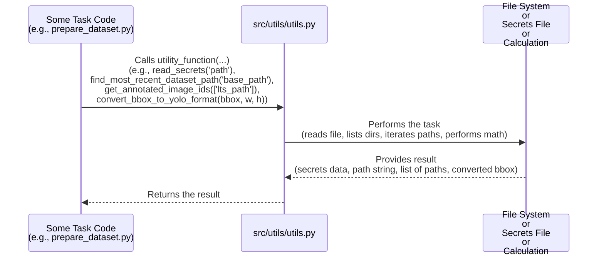

# Chapter 9: Core Utility Functions

Welcome to the final chapter of our `SemiF-PlantDetection` tutorial series! So far, we've explored the main building blocks of the project:
*   Managing settings with [Hydra Configuration](01_hydra_configuration_system_.md) ([Chapter 1](01_hydra_configuration_system_.md)).
*   Switching between workflows using [Pipeline Modes](02_pipeline_modes_.md) ([Chapter 2](02_pipeline_modes_.md)).
*   Finding data and keeping secrets safe with [Data and Secrets Locations](03_data_and_secrets_locations_.md) ([Chapter 3](03_data_and_secrets_locations_.md)).
*   Selecting relevant images from the database ([Chapter 4](04_data_selection_from_database_.md)).
*   Getting the actual image files ([Chapter 5](05_image_retrieval_.md)).
*   Preparing data for annotation in CVAT ([Chapter 6](06_cvat_data_preparation___import_.md)).
*   Structuring data for model training ([Chapter 7](07_training_data_structuring_.md)).
*   And finally, training the object detection model itself ([Chapter 8](08_model_training_.md)).

Throughout these different steps, you might have noticed that certain small, helpful actions are needed repeatedly. For instance, reading a file, finding a specific directory, or converting data from one format to another. If we wrote the code for these common tasks separately within *each* main step (like in the data selection code, then again in the image retrieval code, and again in the data structuring code), we'd end up with a lot of repeated code. This makes the project harder to manage and more prone to errors.

Imagine building a house. Each major phase (laying the foundation, building the walls, putting on the roof) requires tools. Instead of buying a new hammer for each phase, you have a shared toolbox with hammers, screwdrivers, measuring tapes, etc. Any worker on any phase can use these shared tools when needed.

In `SemiF-PlantDetection`, the **Core Utility Functions** are our shared toolbox. They are small, reusable helper functions that perform common tasks needed by various parts of the pipeline.

## What are Core Utility Functions?

This concept represents a collection of functions designed to be used across different modules and tasks in the project. They don't belong exclusively to "preprocess" or "train"; they are general helpers. In this project, many of these functions are located in the `src/utils/utils.py` file, acting as a central place for these common tools.

Their main purpose is to:
*   **Avoid repetition:** Write the code for a common task once and reuse it everywhere.
*   **Keep code clean:** Main task logic stays focused on its primary job, deferring common chores to utilities.
*   **Make updates easier:** If a common task needs changing (like how we find the most recent directory), you only change it in one place.

Let's look at a few examples of utility functions we've actually encountered or will find useful, based on the provided code snippets:

### 1. Reading Secrets Securely

We learned in [Chapter 3: Data and Secrets Locations](03_data_and_secrets_locations_.md) that sensitive information (like CVAT credentials) is stored in a separate secrets file. Multiple parts of the code might need to read this file. Instead of each part implementing file reading and YAML parsing, there's a utility function for it.

*   **Purpose:** To read a YAML file containing sensitive information.
*   **Used by:** [Data and Secrets Locations](03_data_and_secrets_locations_.md) (conceptually), [CVAT Data Preparation & Import](06_cvat_data_preparation___import_.md).
*   **The Function:** `src.utils.utils.read_secrets`

Here's how a task needing secrets might call it (simplified from `src/preprocessing/cvat_importer.py`):

```python
# Inside a class or function needing secrets...
from src.utils.utils import read_secrets # <-- Import the utility function

def login_to_service(self):
    # Get the path to the secrets file from the main config object (cfg)
    secrets_file_path = self.cfg.secrets_path 
    
    # Use the utility function to read the secrets
    all_secrets = read_secrets(secrets_file_path) 
    
    # Access specific secrets (e.g., CVAT credentials)
    cvat_creds = all_secrets.get('cvat') 
    
    # Use cvat_creds['username'] and cvat_creds['password']
    print(f"Attempting login with user: {cvat_creds.get('username')}")
    # ... login code ...
```

This snippet shows that the task code doesn't worry about *how* the file is read; it just calls the `read_secrets` utility function, passes the file path (obtained from the main configuration `cfg`), and gets the secrets back.

### 2. Finding the Most Recently Created Dataset Directory

Several tasks (like [Image Retrieval](05_image_retrieval_.md), [CVAT Data Preparation & Import](06_cvat_data_preparation___import_.md), [Training Data Structuring](07_training_data_structuring_.md), and [Model Training](08_model_training_.md)) need to process the output of a previous step. For example, the image downloader needs the CSV created by the data selector. Since outputs are saved in timestamped directories (e.g., `data/training_selection/YYYY-MM-DD/HH-MM-SS/`), tasks need a reliable way to find the *latest* such directory if no specific path is provided.

*   **Purpose:** To automatically find the path to the most recent subdirectory within a given base directory, based on date and time.
*   **Used by:** [Image Retrieval](05_image_retrieval_.md), [CVAT Data Preparation & Import](06_cvat_data_preparation___import_.md), [Training Data Structuring](07_training_data_structuring_.md), [Model Training](08_model_training_.md).
*   **The Function:** `src.utils.utils.find_most_recent_dataset_path`

Here's how a task needing the latest dataset path might call it (simplified, e.g., from `src/preprocessing/download_images.py`):

```python
# Inside a class or function needing the latest data path...
from src.utils.utils import find_most_recent_dataset_path # <-- Import utility

def initialize_task(self):
    # Get the base path where previous datasets are saved from config
    base_path_from_config = self.cfg.database.dataset.output_path
    
    # Use the utility function to find the latest one
    latest_dataset_directory = find_most_recent_dataset_path(base_path_from_config)
    
    # Now you can use latest_dataset_directory to find the CSV file, etc.
    csv_file = latest_dataset_directory / "training_images.csv"
    print(f"Looking for CSV at: {csv_file}")
```

Again, the code that *needs* the path doesn't implement the logic to list directories, sort by date/time, etc. It simply calls the utility function.

### 3. Finding Existing Human Annotations

The [Training Data Structuring](07_training_data_structuring_.md) task needs to know if human annotations exist for images in specified long-term storage locations. This involves searching multiple directories for `.txt` files corresponding to image IDs.

*   **Purpose:** To search specified directories and find the paths of all human-annotated label files (`.txt`), typically returning a mapping from image ID to file path.
*   **Used by:** [Data and Secrets Locations](03_data_and_secrets_locations_.md) (conceptually, listing LTS paths), [Training Data Structuring](07_training_data_structuring_.md).
*   **The Function:** `src.utils.utils.get_annotated_image_ids`

Here's how the data structuring task might call it (simplified from `src/training/prepare_dataset.py`):

```python
# Inside the PrepareDataset class initialization...
from src.utils.utils import get_annotated_image_ids # <-- Import utility

def __init__(self, cfg: DictConfig):
    self.cfg = cfg
    
    # Get the list of LTS annotation directories from config
    lts_annotation_paths = self.cfg.paths.lts_human_annotations
    
    # Use the utility function to find all human annotation files
    self.human_annotations = get_annotated_image_ids(lts_annotation_paths)
    
    print(f"Found {len(self.human_annotations)} human annotated images.")
    # self.human_annotations is now a dictionary like {'image_id1': Path('/path/to/label1.txt'), ...}
```

The utility function encapsulates the logic of iterating through paths and finding the relevant files.

### 4. Converting Bounding Box Formats

Both [CVAT Data Preparation & Import](06_cvat_data_preparation___import_.md) and [Training Data Structuring](07_training_data_structuring_.md) need to work with bounding box coordinates. The data from the database might be in one format ([x, y, width, height] from the top-left corner), but the YOLO format required for training is different ([center_x, center_y, width, height] normalized by image dimensions). Converting between these formats is a common geometry calculation.

*   **Purpose:** To convert a bounding box from one format ([x, y, width, height] top-left pixel coordinates) to another (YOLO format: [center_x, center_y, width, height] normalized coordinates).
*   **Used by:** [CVAT Data Preparation & Import](06_cvat_data_preparation___import_.md), [Training Data Structuring](07_training_data_structuring_.md).
*   **The Function:** `src.utils.utils.convert_bbox_to_yolo_format`

Here's how a task processing annotations might call it (simplified from `src/preprocessing/cvat_formatter.py` or `src/training/prepare_dataset.py`):

```python
# Inside a loop processing annotations for an image...
from src.utils.utils import convert_bbox_to_yolo_format # <-- Import utility

def process_annotation(self, annotation, image_width, image_height):
    bbox_xywh = annotation.get('bbox_xywh') # Get bbox in [x, y, w, h] format
    if not bbox_xywh:
        return # Skip if no bbox

    # ... potentially scale bbox if image was resized ...
    scaled_bbox = bbox_xywh # Use scaled_bbox if resizing happened, otherwise original

    # Use the utility function to convert the bbox format
    center_x, center_y, norm_width, norm_height = convert_bbox_to_yolo_format(
        scaled_bbox, # Input bbox (could be scaled)
        image_width, # Width of the image the bbox corresponds to
        image_height # Height of the image the bbox corresponds to
    )

    # Now use the converted, normalized YOLO coordinates
    yolo_line = f"{class_id} {center_x:.6f} {center_y:.6f} {norm_width:.6f} {norm_height:.6f}\n"
    # ... write yolo_line to file ...
```

This utility function handles the mathematical calculation required for the conversion, keeping that logic separate from the annotation processing loop.

## How Utility Functions Work (Under the Hood)

The actual implementation of these utility functions is relatively simple Python code. They live in files like `src/utils/utils.py`.



Here's a look at the simplified code for a couple of these utility functions from `src/utils/utils.py`:

**`read_secrets` (Simplified):**

```python
# src/utils/utils.py (Simplified)
import yaml
import logging

log = logging.getLogger(__name__)

def read_secrets(keypath):
    """Reads secrets from a YAML file."""
    try:
        # Standard Python file reading and YAML parsing
        with open(keypath, "r") as file:
            secrets = yaml.safe_load(file)
        log.info(f"Successfully read secrets from {keypath}")
        return secrets
    except FileNotFoundError:
        log.error(f"Secrets file not found at {keypath}")
        raise # Re-raise the exception
    except Exception as e:
        log.error(f"Error reading secrets file {keypath}: {e}")
        raise

# ... other functions ...
```
This function uses the standard Python `open` function and the `PyYAML` library (`yaml`) to read and parse the file. It includes basic error handling for `FileNotFoundError`.

**`find_most_recent_dataset_path` (Simplified):**

```python
# src/utils/utils.py (Simplified)
from pathlib import Path
import logging

log = logging.getLogger(__name__)

def find_most_recent_dataset_path(base_dataset_path):
    """
    Find the most recent dataset directory from a hierarchical date/time structure.
    """
    base_dataset_path = Path(base_dataset_path)
    
    if base_dataset_path.exists():
        # List directories and sort them descending by name (which works for YYYY-MM-DD)
        date_dirs = [d for d in base_dataset_path.iterdir() if d.is_dir()]
        date_dirs.sort(reverse=True) # Latest date first
        
        if date_dirs:
            # Now look for timestamp dirs inside the latest date dir
            hr_min_sec_dirs = [d for d in date_dirs[0].iterdir() if d.is_dir()]
            hr_min_sec_dirs.sort(reverse=True) # Latest time first
            
            if hr_min_sec_dirs:
                return hr_min_sec_dirs[0] # Return the latest time path
            else:
                log.warning(f"No timestamp dirs found, using date path: {date_dirs[0]}")
                return date_dirs[0] # Fallback to date path
        else:
            log.warning(f"No date directories found, using base path: {base_dataset_path}")
            return base_dataset_path # Fallback to base path
    else:
        log.warning(f"Base dataset path does not exist: {base_dataset_path}")
        return base_dataset_path # Return base path even if it doesn't exist

# ... other functions ...
```
This function uses the `pathlib.Path` object to interact with the file system. It lists directories (`iterdir()`), checks if they are directories (`is_dir()`), sorts them by name (which works because of the YYYY-MM-DD/HH-MM-SS format), and picks the first (most recent) one after sorting in reverse.

These examples show that utility functions wrap common, repeatable logic. You don't need to understand the sorting algorithm or the YAML parsing details when you use `find_most_recent_dataset_path` or `read_secrets`; you just need to know what input they need and what output they provide.

## Conclusion

In this chapter, we looked at the concept of **Core Utility Functions**:
*   They are general-purpose helper functions used across different parts of the `SemiF-PlantDetection` project.
*   They act like a shared toolbox, containing reusable code for common tasks.
*   Examples include reading secrets from files, finding the most recently created directory, locating human annotation files, and converting bounding box formats.
*   Using these utilities helps avoid code repetition, keeps the main task logic clean, and makes the codebase easier to maintain.
*   They are typically found in `src/utils/utils.py` and are simply imported and called by other functions as needed.

Understanding these utility functions helps you see how the project's various components rely on shared helpers to perform common tasks efficiently and consistently.

This concludes our journey through the core concepts of the `SemiF-PlantDetection` project! We've covered everything from configuring settings and running different workflows to preparing data, training a model, and leveraging reusable helper functions. You should now have a solid foundation to understand how the project works and how to run and adapt it for your own needs.

---

Generated by [AI Codebase Knowledge Builder](https://github.com/The-Pocket/Tutorial-Codebase-Knowledge)